# :material-pipe: Cable/Pipetracker Field Verification Tests

<div class="page-meta" markdown>
<span class="meta-item">:material-tag-outline: <strong>Calibration</strong></span>
<span class="meta-item">:material-format-list-checks: <strong>Verification Procedure</strong></span>
<span class="meta-item">:material-calendar: <strong>2026-03-02</strong></span>
</div>

!!! abstract "Purpose"
    Field verification tests for pipe/cable tracker systems over buried cables or pipes. Covers the three standard tests: Vertical Range to Target (VRT), Lateral Offset, and Mobile Pipe/Cable tests. These tests determine the detection capabilities and accuracy of the tracker system before commencing a pipeline/cable inspection survey.

---

## :material-arrow-up-down: Vertical Range to Target (VRT) Test

### Purpose

Prior to beginning a pipe/cable inspection survey, the client can request a VRT test be performed over a section of the pipe/cable. This involves the ROV holding position above the pipe/cable and recording a file while remaining static at a number of predetermined heights. The aim of this test is to determine how much impact an increase in vertical distance from the ROV to the pipe/cable has on the depth of the pipe/cable generated by the cable/pipetracker.

### Method

Whilst carrying out the test, the horizontal position of the ROV should remain as consistent as possible over the pipe/cable and only the ROV altitude should change. In the following example the data is logged at an altitude of 0.5m, 1.0m, 1.5m and 2.0m.

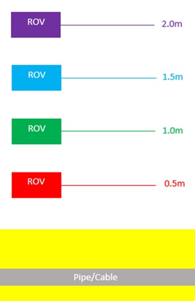

### Procedure

Once the data has been logged and imported, the relevant parts must be extracted from NaviEdit. The pipetracker data can be viewed by right clicking on the desired .sbd file in NaviEdit and selecting **Data Editor**. The data import options will then be displayed and the **Pipetracker** option should be selected.

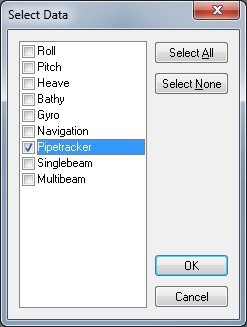

The Data Editor window should then open and look something like the following diagram.

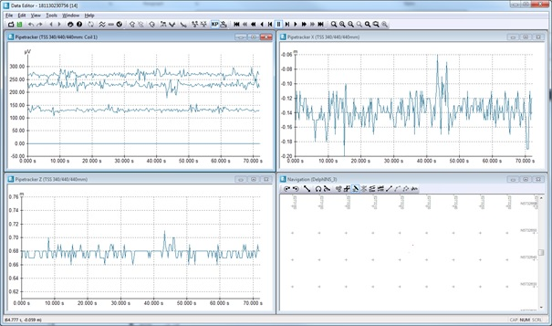

The windows that contain the data that is of most use when performing a VRT Test are the **Pipetracker X** and **Pipetracker Z** windows. The data can be extracted directly from Data Editor by clicking on the desired window and typing ++ctrl+c++. The data can now be copied directly into Excel. The data should then be organised into columns similar to the following example.

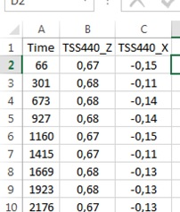

This process can now be repeated for the logging files for each of the other ROV altitudes. Each logging file should be copied into a separate tab within Excel in order to make it clear which file is being used.

This data must now be compiled into a graph with the pipe/cabletracker altitude over cable (TSS440_Z) as the y-axis and the horizontal distance to cable (TSS440_X) being the x-axis. The graph produced should resemble the following example. In this example, the cable tracker was only able to track the cable to an altitude of 1.3m, so even though altitudes of 0.5-2.0m were logged, only the data from 0.5m and 1.0m are displayed.

!!! tip
    Some clients may also request that the process be repeated with the ROV's heading altered by 180°. If this is the case, the steps involved are the same as detailed in this guide.

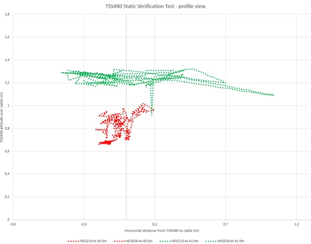

---

## :material-arrow-left-right: Lateral Offset Test

### Purpose

As well as a VRT test, the client may also request that a lateral offset test be carried out prior to beginning a pipe/cable inspection survey over a section of cable/pipe. This involves the ROV holding a consistent altitude above the pipe/cable, whilst recording a file when remaining static at a number of predetermined lateral offsets. The aim of this test is to determine how much impact an increase in lateral offset from the ROV to the pipe/cable has on the position of the pipe/cable generated by the cable/pipetracker.

### Method

Whilst carrying out the test the altitude of the ROV should remain as consistent as possible and only the lateral offset should change. In the following example the data was logged with lateral offsets of 1m, 2m, and 3m on both the port and starboard side of the pipe.

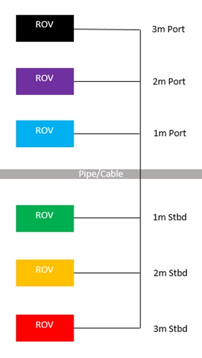

### Procedure

In order to assess the effect of a change in lateral offset, it is necessary to compare the ROV track position and the pipe/cable position generated by the pipe/cabletracker.

#### Step 1: Export ROV Track

The ROV track can be exported from NaviEdit by right clicking on the desired files and selecting **Export > Ascii > ETrack rov navigation**.

!!! info "Export Settings"
    - Export navigation tracks to an appropriately named folder
    - Ensure the output selection is set to **Common Reference Point (CRP)** -- this is required for this test
    - Default settings can be left in place for other options

After the files have been exported, a separate .etr file should have been created for each of the selected files with the same name as the original .sbd file.

#### Step 2: Extract Pipetracker Position

The pipetracker data needs to be exported from NaviModel. Go to the NaviEdit section of the NaviModel project tree, right click on the required files and select **Import pipetracker**.

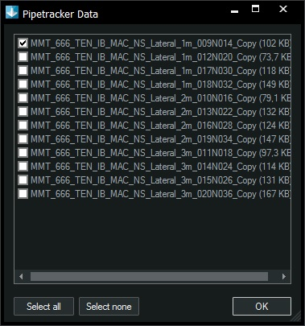

Once the pipetracker has been imported into NaviModel, it can be saved as a digitised line by right clicking on the Pipetracker section of the project tree and selecting **Save As > Digitised line (*.dig)**. This digitised line can then be opened in a text editor and the easting, northing and water depth copied into Excel. Repeat for each lateral offset file.

#### Step 3: Compare in Excel

The ROV track and pipe/cabletracker data position and water depth data should now all be listed in columns for each log file.

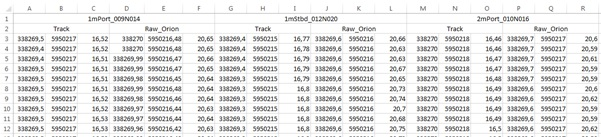

#### Step 4: Produce Charts

**ROV Track Plan View** -- should show tight clusters of points spaced 1m apart.

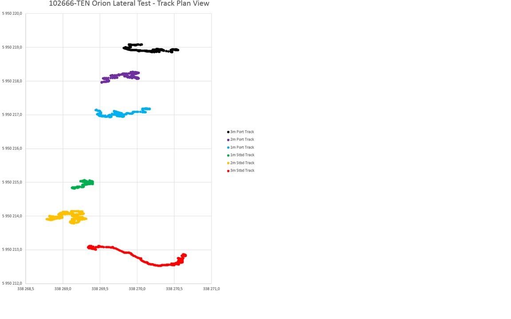

**Pipetracker Plan View** -- should show tight clusters at approximately the same location. The larger the lateral offset, the more the pipe/cable position will wander.

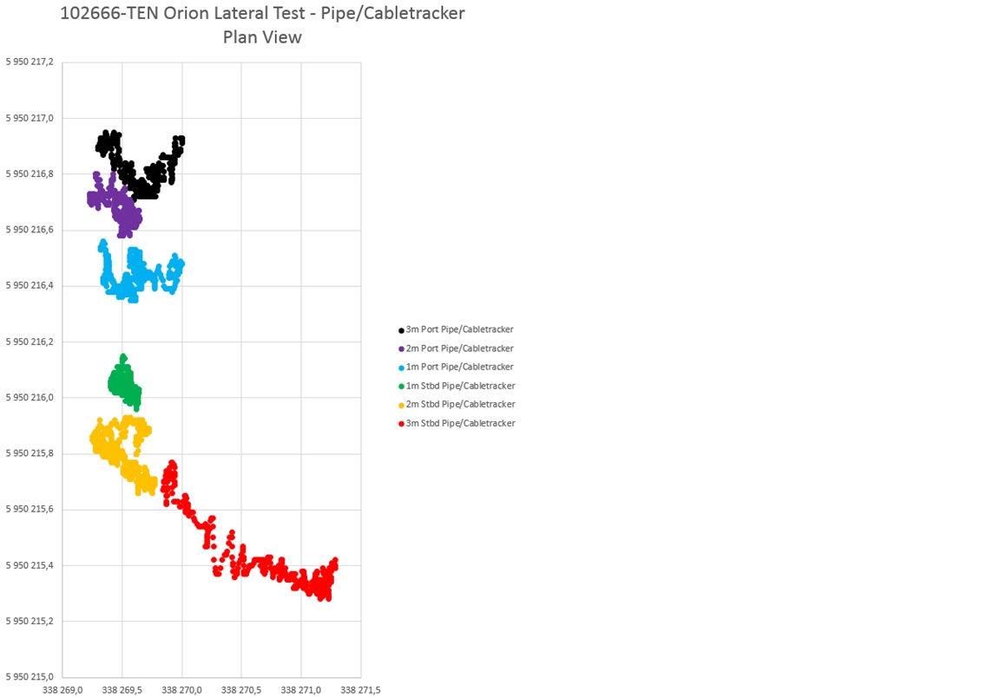

**Profile View** -- should show tight clusters at the same depth for all lateral distances.

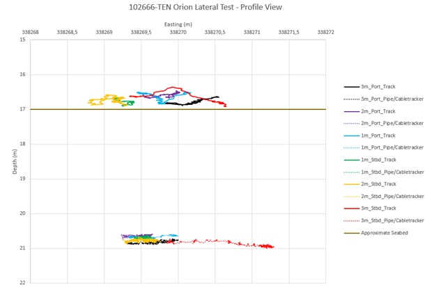

---

## :material-run: Mobile Pipe/Cable Test

### Purpose

A third cable/pipe verification test that can be requested by a client is a Mobile Pipe/Cable Test. The purpose of this test is to ascertain the cable position while flying the ROV along and above the cable trajectory over a distance of at least 50m.

### Method

This involves a section of the pipe/cable being surveyed at the standard survey speed and altitude in order to verify the pipe/cabletracker top of cable tracking. This test is performed twice at opposite headings, so as to compare the findings from each heading to ensure they provide a similar position and depth for the pipe/cable.

### Procedure

#### Step 1: Build Database in NaviModel

Once the mobile pipe/cable test survey lines have been acquired, a database file needs to be built in NaviModel. The purpose is to clean the data and assess its overall quality. The data should also be tidally corrected and any post-processing software (DelphINS, Janus) utilised to ensure the data resembles the actual seabed as closely as possible.

As the pipe/cable is buried, it is impossible to see any signs of the pipe/cable in the DTM, so the position and depth is based on the data from the pipe/cabletracker.

#### Step 2: Clean Pipetracker Data

The pipetracker data can be viewed in NaviEdit by right clicking on the desired file and selecting **Pipetracker**.

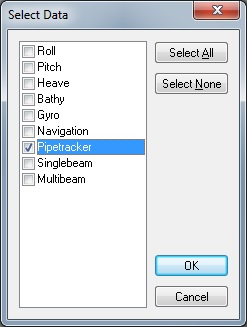

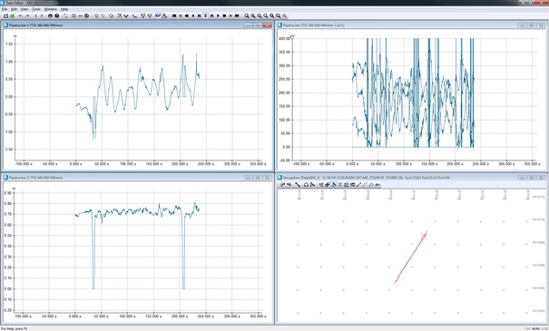

This window can be used to remove any obvious errors. When most pipe/cabletrackers lose track of the pipe/cable they tend to record a zero value in the X and Z windows. These can be removed by drawing a region round the erroneous values.

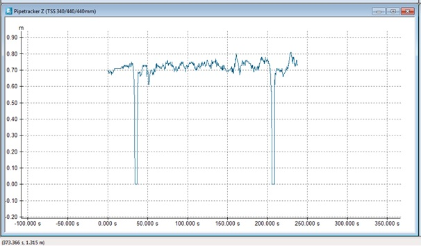

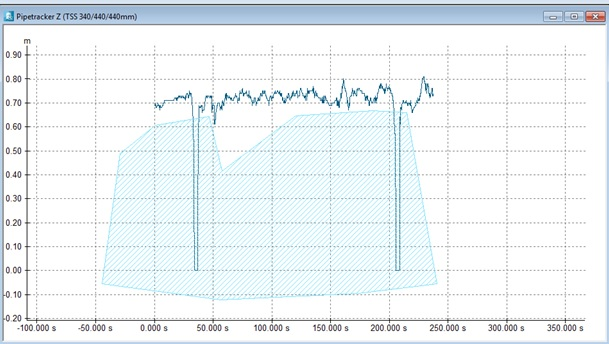

Once the region has been created, the points within it can be deleted by right clicking the region and selecting **Delete Inside Region**.

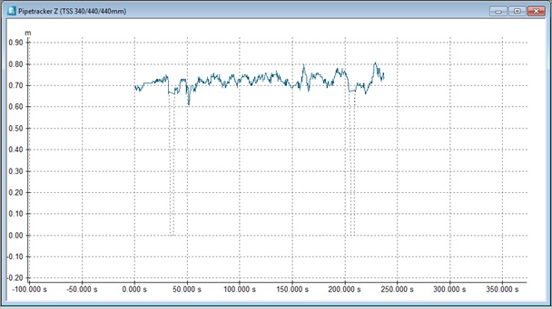

Once the zero values have been deleted, save and close the Data Editor window.

#### Step 3: Import Pipetracker to NaviModel

The pipe/cabletracker data is now ready to be loaded into NaviModel. Go to the NaviEdit section of the NaviModel project tree, right click on the required files and select **Import pipetracker**.

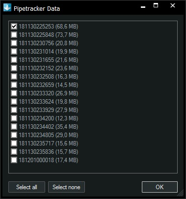

The pipetracker data should appear in the NaviModel map view:

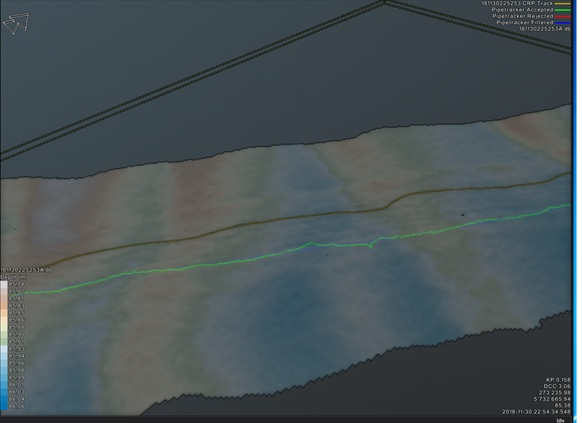

!!! info "Colour Coding"
    - **Green points** -- accepted raw pipe/cabletracker points
    - **Red points** -- rejected pipe/cabletracker points
    - **Blue line** -- filtered pipe/cabletracker position

    These colours can be changed in the Pipetracker section of the project tree.

#### Step 4: Reject Bad Data

Assess the data in 3D view to identify unrealistic data points.

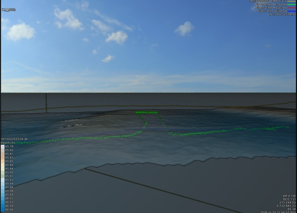

Data can be rejected by right clicking on the Pipetracker section of the project tree and selecting **Reject**. A red circle appears on the map view -- any accepted data within this circle will be rejected when clicking.

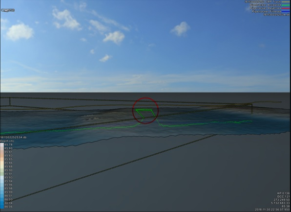

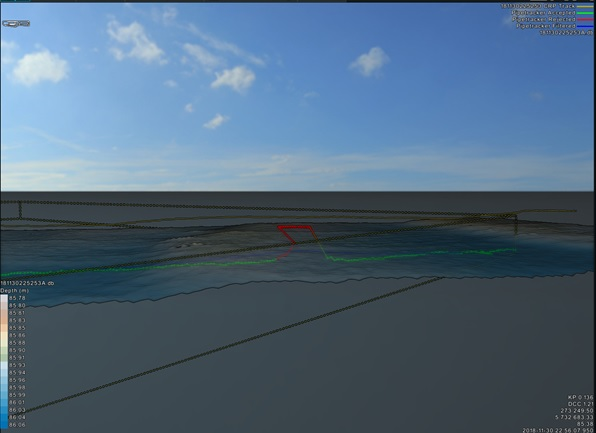

After all necessary data has been rejected:

1. **Save to NaviEdit** -- right click Pipetracker section > Save to NaviEdit (preserves edits for future reimport)
2. **Recalculate** -- right click Pipetracker section > Recalculate (updates filtered position excluding rejected data)

#### Step 5: Import Runline and ROV Track

Import the relevant runline (.rlx) file into NaviModel by dragging and dropping into the map view. If more than one runline is present, activate the correct one via right click > **Activate**.

Export the ROV track from NaviEdit: right click > **Export > Ascii > ETrack rov navigation**. Set output to **Common Reference Point (CRP)**.

#### Step 6: Create Pipe in NaviModel

Click **Tools > Pipe > New pipe**. Enter the pipe/cable diameter (display is in inches, but metres can be entered and will be automatically converted).

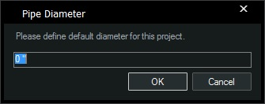

Enter the start and end KP. Ensure the pipe covers at least the required test distance (50m).

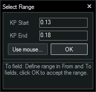

The pipe should now be visible in the map view.

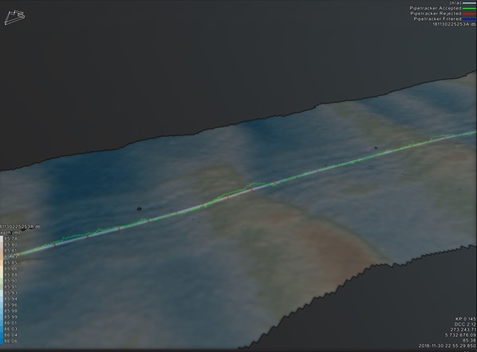

It should automatically snap to the filtered pipe/cabletracker position. If not, check that **Use filtered ptk** is set to **True** in the Pipe properties.

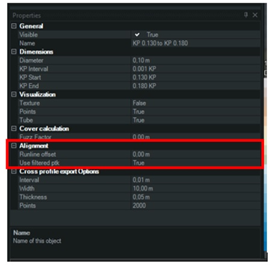

!!! tip "Flexibility Settings"
    The default horizontal and vertical flexibility values are 0.2 cm/m, but this may be too rigid depending on the pipe/cable diameter. A large pipe will be less flexible than a thin cable. Adjust these values in the Pipetracker properties section so that the filtered position more accurately represents the pipe/cable.

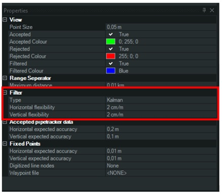

#### Step 7: Export Pipe Data

Right click on the pipe in the project tree and select **Export**.

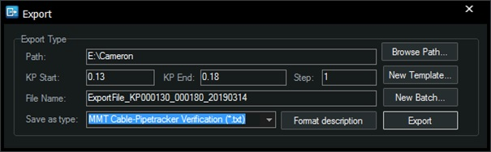

The KP range should automatically match the source pipe extents. Save as **Cable-Pipetracker Verification (*.txt)**.

!!! info "Custom Export Template"
    If the Cable-Pipetracker Verification export type is not available, add it manually. Open the ExportTypes file (`C:\ProgramData\EIVA\NaviModel Producer\ExportTemplates`) and paste:

    ```
    Cable-Pipetracker Verification|txt|;|<Enter>|Pipe - KP^3|Pipe - Distance to ROV^2|Pipe - Distance to Runline^2|Pipe - Depth^2|
    ```

The exported file should contain the horizontal distance from pipe/cable to ROV track, the distance cross course (DCC) from pipe/cable to runline, and the depth.

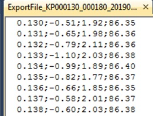

Copy the data into Excel:

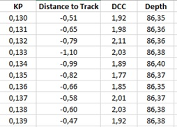

#### Step 8: Compare Opposite Headings

Repeat the above process using data acquired with ROV heading 180° different from the first file. Copy into a separate tab within Excel. Calculate the delta difference between the two headings:

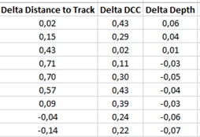

#### Step 9: Produce Verification Deliverables

Use the data to produce charts and a summary table showing horizontal and vertical agreement between the two line headings:

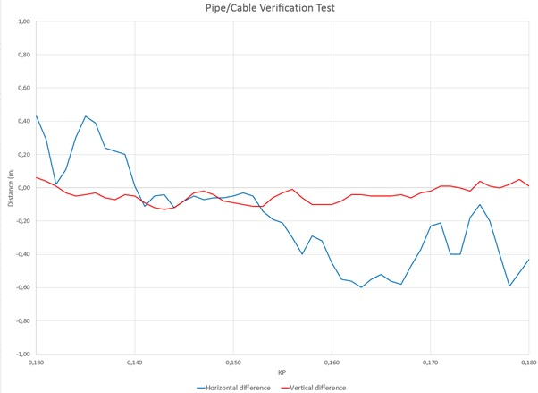

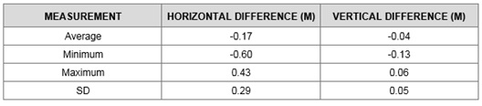
