# :material-access-point: cNODE miniS Transponder Configuration

:material-tag-outline: <strong>Equipment</strong>
:material-format-list-checks: <strong>Configuration Guide</strong>
:material-calendar: <strong>2026-03-02</strong>

!!! abstract "Purpose"
    Configuration and installation guide for Kongsberg cNODE miniS transponders used for acoustic positioning with HiPAP USBL systems. Covers transponder software configuration, ROV mounting and initialisation, responder mode setup, and APOS software configuration for beacon tracking.

---

## :material-information-outline: Overview

This guide covers the operation and installation of Kongsberg cNODE miniS transponders for use with HiPAP USBL systems. The following tasks are covered:

- Transponder configuration
- ROV installation
- APOS settings

!!! info "Relevance"
    Tech department, Senior Surveyor.

---

## :material-cog: Transponder Configuration Software

Before first use the cNODE transponder should be connected to a PC via the supplied serial communication cable. The software enables the user to change basic functions as well as view diagnostic information.

### Connection Hardware

Locate the PC communication cable which is supplied to the vessel.

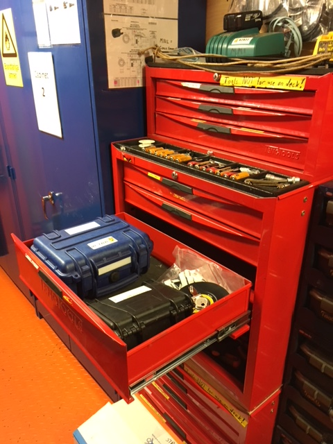

The kit should contain:

- 2x serial to MCIL cables
- 1x serial to USB cable
- 1x USB dongle containing software

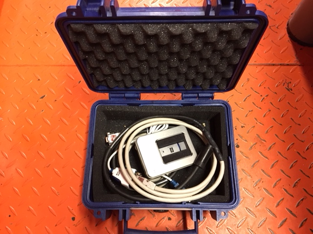

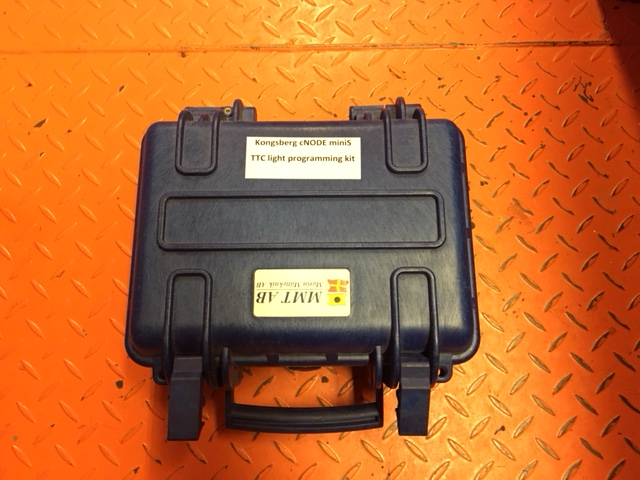

### Software Operation

1. Install the software supplied on the Kongsberg USB stick

2. Connect the serial cable to the PC via USB or serial port depending on which type is available

    !!! tip
        Take note of the serial port allocated to the USB to serial adaptor using Device Manager.

3. Connect the cNODE transponder to the supplied interface cable

4. Start the Transponder Configurator software

    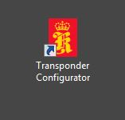

5. Click on the **Options** tab and select the correct COM port to communicate with the transponder, then click **OK**

    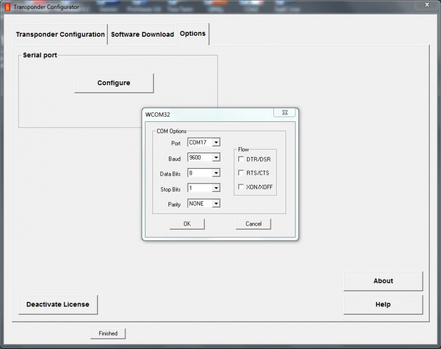

6. Select the **Transponder Configuration** tab and click **Get config from Tp**. If communication is successful the page will auto-populate with the transponder values as shown below. If the boxes turn red then communication has failed, likely caused by incorrect COM port selection.

    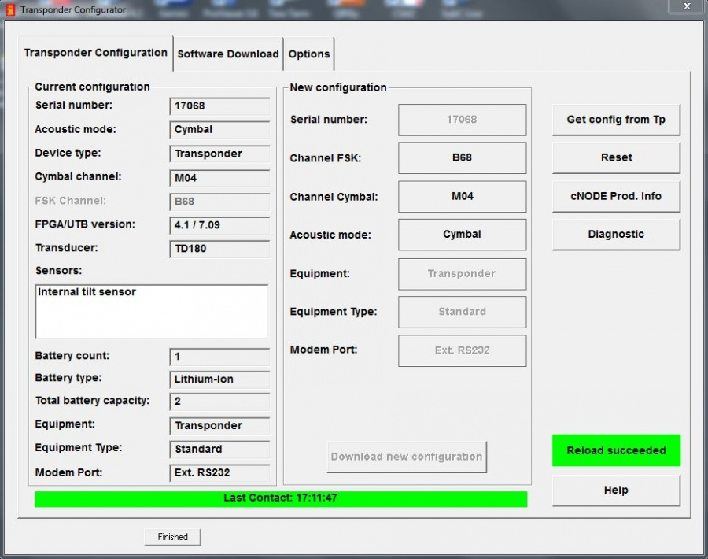

7. From this page you can change the **FSK channel**, **Cymbal channel** and the **acoustic mode**. The preferred mode is typically Cymbal.

8. Following any changes, click the **Download new configuration** tab to confirm changes

9. Close software and disconnect transponder -- transponder is ready for use

---

## :material-robot-industrial: ROV Installation

The transponder is mounted to the ROV via a dedicated mounting bracket as pictured below:

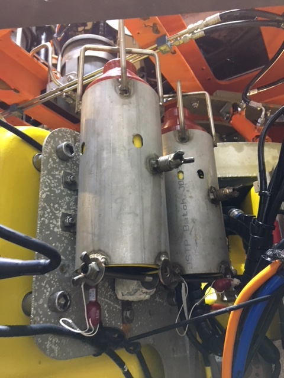

The transponder should be inserted into the bracket from the underside. Once in position, the long bolt with wing nut at the lower part of the bracket should be placed in position to prevent the transponder from moving.

!!! warning "Do Not Over-Tighten"
    There is a compression bolt approximately midway up the bracket. Do not over-tighten this bolt as it may result in damage to the outer cover of the transponder.

### Transponder Initialisation

To enable the cNODE into **transponder mode**, place the red dummy plug into the cNODE bulkhead receptacle.

### Responder Mode

To enable **responder mode**:

1. Remove the red dummy plug
2. Connect the responder cable which connects to the ROV POD
3. Blank the red dummy plug using a **MCIL8M dummy plug** to prevent water ingress

!!! info
    Two interface cables are required to connect the responder to the ROV: a primary jumper cable and a secondary jumper cable connecting to the cNODE.

---

## :material-radar: HiPAP APOS Configuration

APOS software is used to control beacon tracking and modes. It also contains inputs for GPS (typically from POS MV), motion data (from a vessel Seapath MRU), and PPS pulse from the primary system.

On most vessel setups, offsets are defined and output to QINSy as a **PSIMSSB driver**. This decodes the USBL X Y Z data relative between the HiPAP transducer and beacon (responder or transponder).

!!! info "QINSy Database Requirements"
    - A HiPAP node and offset to CRP are required in the QINSy database
    - Relative offsets to CRP are required
    - The Z value should be mapped to the extended pole distance
    - SSBL output is Local Position Cartesian X/Y
    - Consult the QINSy computation setup to ensure correct beacon position is sent to the INS subsea

### APOS Main Interface

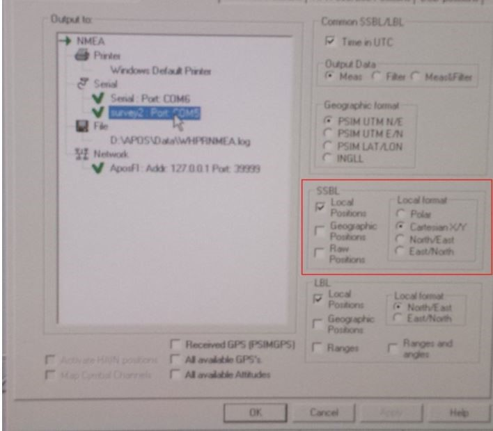

### APOS Overview

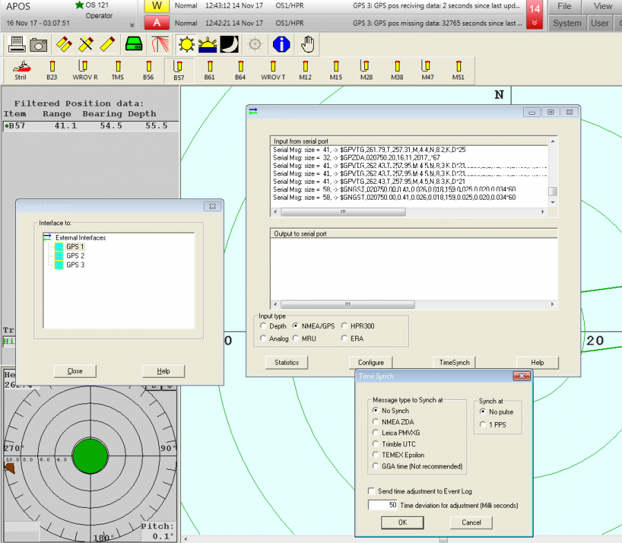

The bottom row displays beacons (click to activate). The top row shows options including the important **SSBL wizard** shortcut icon.

### GPS Input

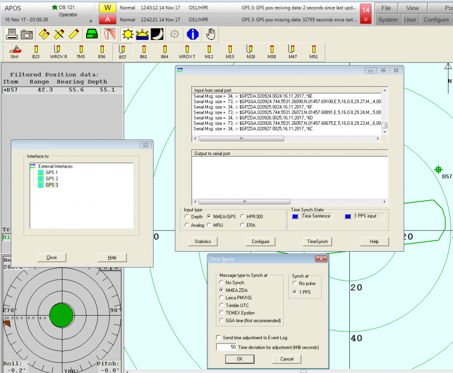

Input GPS 1 -- usually also a redundant GPS input.

### PPS and ZDA Timing

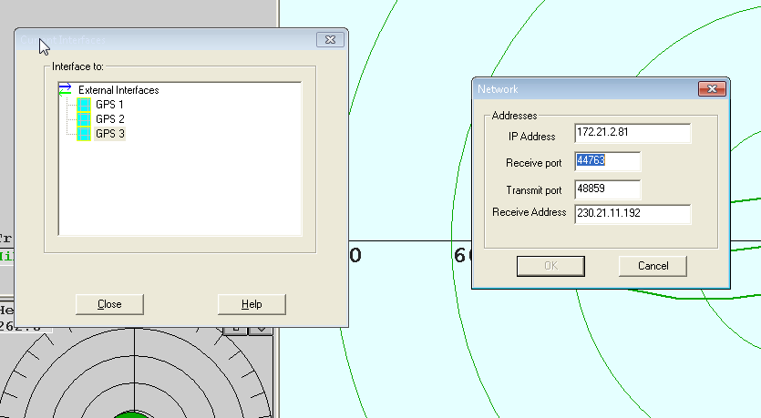

PPS pulse and ZDA input to HiPAP positioning system. Should be identical to QINSy pulse. Time sync flashes between blue and green.

### Network Settings

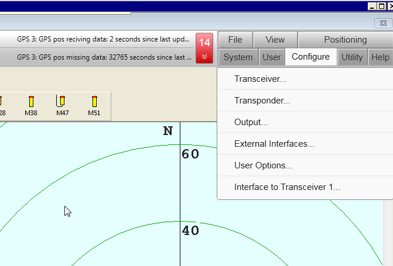

Network settings for I/O on ports.

### Interface Options

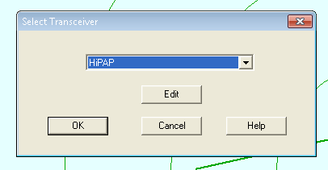

Options for interfaces -- configure transponder for beam angles. External interfaces for GPS, PPS pulse and ZDA input to HiPAP positioning system.

### Transceiver Configuration

APOS configure transceiver:

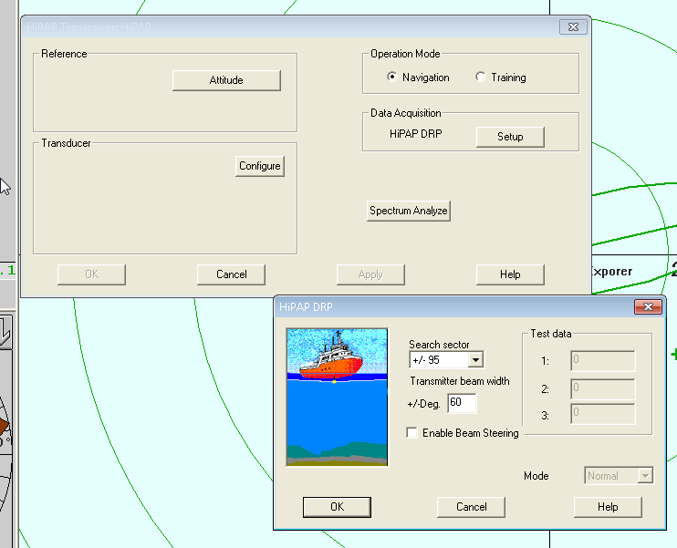

Select and edit system.

### Search Sector

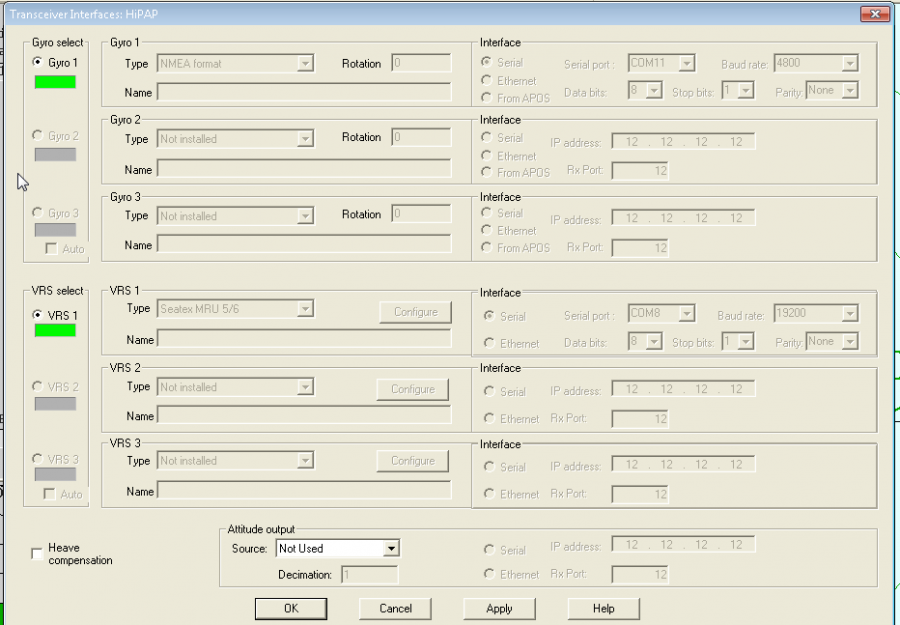

!!! tip "Search Sector Configuration"
    Configure search sector as per survey requirements. When close, angles can be reduced. Increase when towing equipment or if ROV/seabed beacons are further from HiPAP pole.

### GPS and MRU Inputs

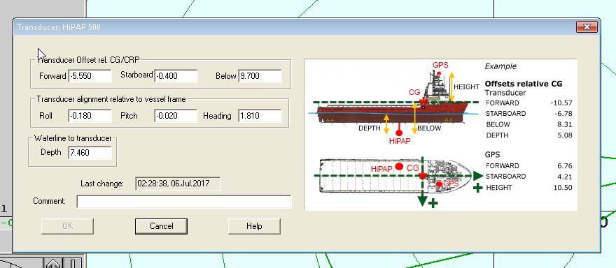

GPS and MRU inputs from Seapath and POS MV.

### Offsets

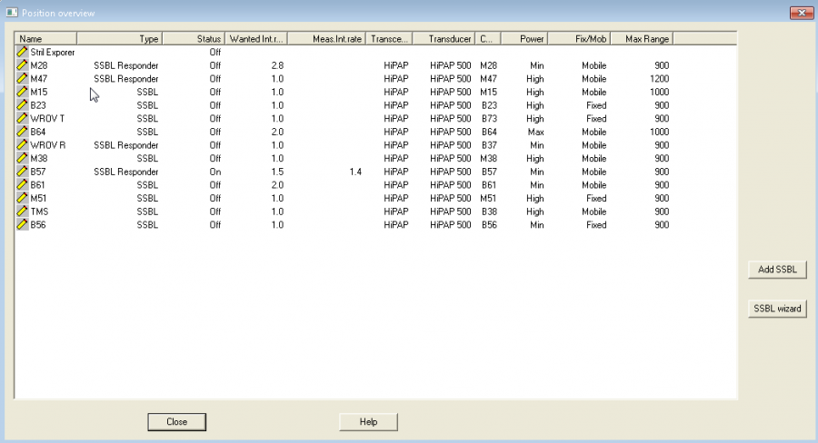

Offsets in APOS set to QINSy node.

### Adding a Beacon (SSBL Wizard)

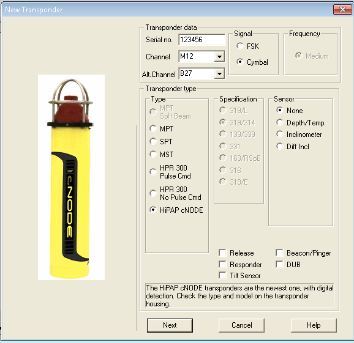

SSBL wizard used to add a beacon to HiPAP.

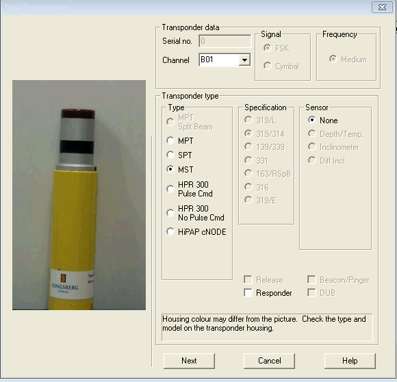

Beacon type, mode (FSK or Cymbal) and channel for cNODE.

### MST Configuration

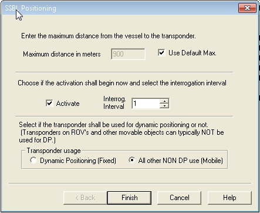

MST config -- set channel matching beacon number.

### ROV Configuration

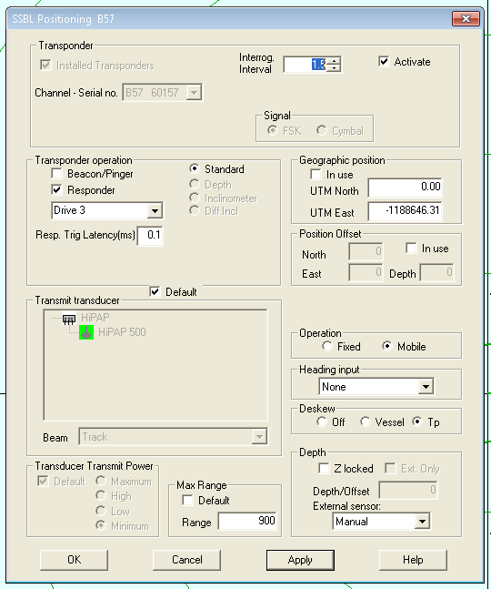

HiPAP recommended ROV configuration settings.

### Responder Settings

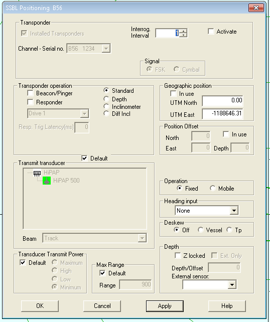

Responder settings: set drive number, powered by ROV control panel.
