# :material-radar: HiPAP USBL System Guide

:material-tag-outline: <strong>Equipment</strong>
:material-format-list-checks: <strong>Equipment Guide</strong>
:material-calendar: <strong>2026-03-02</strong>

!!! abstract "Purpose"
    Comprehensive operational guide for the Kongsberg HiPAP underwater positioning system. Covers system design and principles, transponder types (MST and cNODE), APOS software configuration, external interfaces (GPS, heading, motion), APOS Survey for dual-system operation, AUV operations, and Search and Rescue (SAR) emergency beacon setup.

---

## :material-information-outline: Summary

HiPAP is an underwater positioning system that consists of a spherical transducer with several hundred elements that listen to signals from transponders in the water.

---

## :material-lightbulb-outline: How It Works

An acoustic pulse is transmitted through the water or a signal through a cable to the transponder on the underwater vehicle. The transponder responds with an acoustic pulse of a preset frequency which is detected by the elements on the HiPAP transducer. The time from the initial trigger pulse until the hydrophones detect the acoustic pulse is converted to a **distance** and the difference in time of detection on the 4 hydrophones is converted to an **angle** -- the position of the underwater vehicle is then determined.

To get a more accurate position of the underwater vehicle, HiPAP is used as part of an Inertial Navigation System such as PHINS/ROVINS or Sprint.

---

## :material-cube-outline: Design

The HiPAP systems use an **inverted right-handed coordinate system**:

| Axis | Convention |
|---|---|
| X | Forward positive |
| Y | Starboard positive |
| Z | Down positive |
| Roll | Clockwise around X axis (Starboard down = positive) |
| Pitch | Clockwise around Y axis (Forward up = positive) |

The head is a spherical transducer with several hundred elements covering the whole sphere under the vessel. The system dynamically controls the beam so it is always pointing towards the transponder. Data from roll/pitch sensors are used to compensate the position. The information collected is sent to a processing unit inside the ship where it is connected to a computer running the APOS software.

---

## :material-broadcast: Transponders

### Kongsberg MST

| Model | Depth Rating | Range | Beam Width |
|---|---|---|---|
| MST 319/N | 1000 m | 1000 m | 180° |
| MST 324/N | 2000 m | 2000 m | 80° |
| MST 342/N | 4000 m | 4000 m | 40° |

**NiMH battery operating lifetime:**

- MST 319 and MST 324: 64,800 replies
- MST 342: 32,400 replies

!!! warning
    When using MST 319/N without external power supply, take into account that the generation is old and the battery can be degraded. Battery lifetime will differ from specifications above.

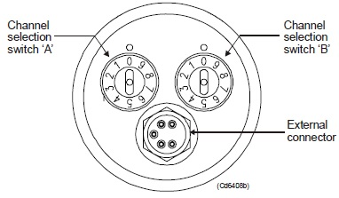

To change the channel, turn **A** to the first number and **B** to the second number. E.g. A=2 and B=5 = channel **B25**.

!!! info
    The Kongsberg MST family supports **FSK mode only**.

### Kongsberg cNODE Mini

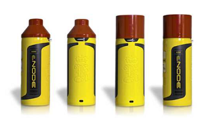

| Model | Depth Rating | Range | Beam Width |
|---|---|---|---|
| cNODE MiniS 34-180 | 4000 m | 1000 m | 180° |
| cNODE MiniS 34-40 | 4000 m | 4000 m | 40° |

**Battery lifetime:**

| Mode | Update Rate | Duration |
|---|---|---|
| Cymbal - Low power | 1 sec | > 2.5 days |
| Cymbal - Low power | 3 sec | > 7 days |
| FSK - High power | 3 sec | > 4.5 days |

To change the channel on the cNODE Mini transponder, the best way is to use the **TTC unit**.

!!! tip "Identifying Beacon Mode Without TTC"
    When powering up the transponders:

    - **Cymbal mode** (M channels): you will hear **one chirp**
    - **FSK mode** (B channels): you will hear **three chirps**

    If the transponder is in Cymbal mode and you enter it in APOS as FSK, you will not get an answer from the transponder, and vice versa. The channel must be correct with respect to Cymbal or FSK.

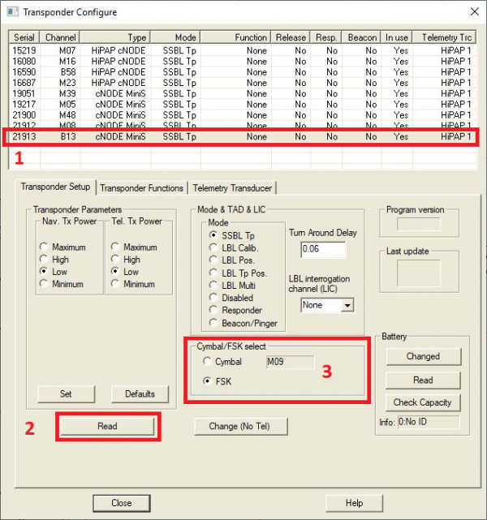

To change the mode: read status from the Transponder (APOS needs to know if transponder is capable of Cymbal), then use the configuration menu to change mode. The swap must be done when the transponder has good acoustic contact with the HiPAP.

!!! info
    Cymbal protocol is supported from HiPAP 501/451/351/351P/101 systems onwards only.

---

## :material-application-cog: HiPAP APOS Software

The HiPAP and HPR systems are operated from the Kongsberg Acoustic Positioning Operating Station (APOS), a PC with a Windows-based operating system. The systems can be operated from one single APOS station or from multiple APOS operator stations connected to a network.

### APOS Transponders

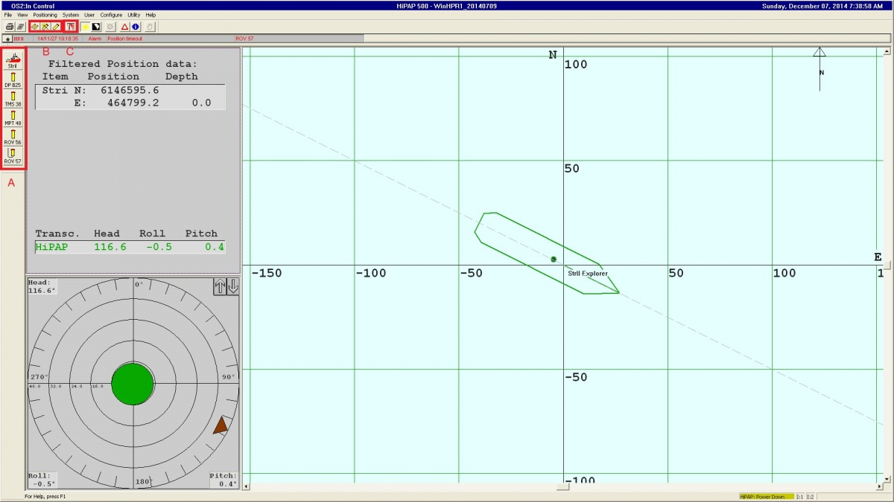

1. On the left side you can see all transponders added to APOS. Go to step 4 if your transponder is in the list. If not, you need to add it to the system.

2. Select **Positioning > New SSBL Positioning Wizard** and fill fields 1-5. Click **Next**.

    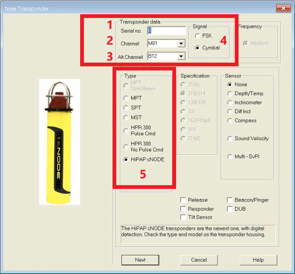

3. Select the mode you want to use. For mobile objects such as ROV, AUV, ROTV etc., **Mobile** mode should be selected. Specify **Interrogation Interval** and **Maximum distance in meters** if required. If the **Active** box is ticked, the created transponder will start to be interrogated immediately. Click **Finish** to complete.

    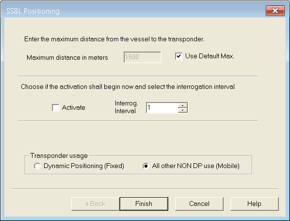

4. Click on a transponder button on the APOS main screen to activate it. The HiPAP transceiver will start tracking.

5. To change the configuration of the transponder, right click on a transponder button and select **Properties**.

    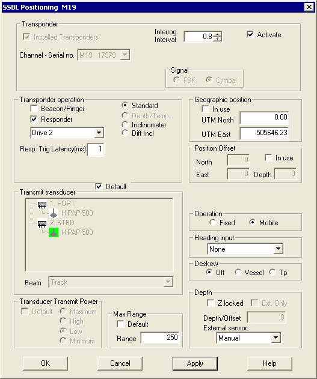

    Tick/untick **Responder** depending if responder or transponder mode is preferred. Different drives can be selected under Responder.

    To delete a transponder from APOS, right click on the button and select **Delete**.

---

## :material-connection: External Interfaces

### Position and Timing Inputs

#### NMEA GGA

1. Configure an NMEA GGA message output from a GPS receiver and input to APOS via either serial COM port or ethernet port. A serial port is the only option if the APOS PC is not on the same VLAN as the GPS receiver.

    Select **Configure > External Interfaces**. Right click on External Interfaces and select **Add GPS**.

    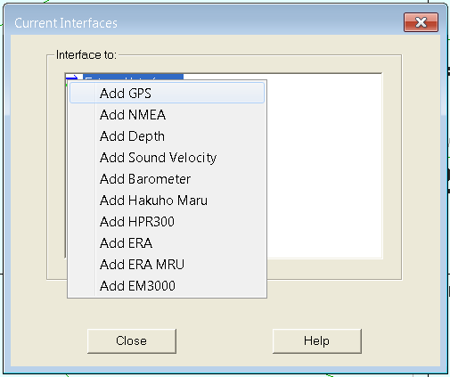

2. Right click on the new interface and select **NMEA format**. Ensure GGA position is selected.

    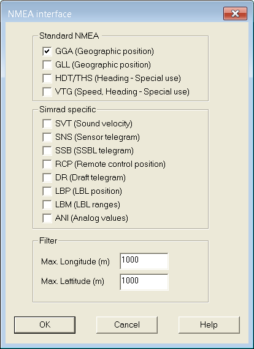

3. Right click on the GGA input to rename it to something logical.

4. The IOserver is a separate program running on the PC. If not already running on the taskbar, right click on the GGA input and select **Activate IOserver**. In the IOserver program, the configure tab enables you to select the correct COM port settings. You should then see the GGA message in the IOserver input box.

    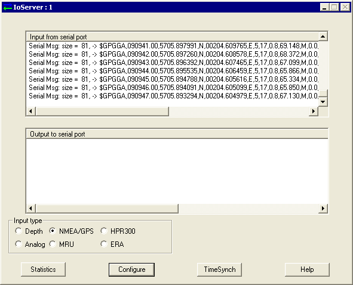

5. Select the correct projection in APOS to convert lat/long to easting and northing. On the main screen, select **System > Geographic Positioning Setup**.

    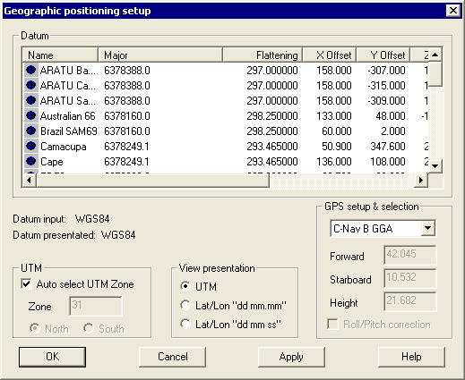

6. Select the recently-added GGA input under **GPS setup & selection** and enter the offset from the transceiver to the GPS antenna.

7. Ensure that the correct UTM zone is selected. The **Auto select UTM Zone** can be used but should be checked before starting operation on a new project.

8. On the main screen, right click on the vessel position and select **Position setup > Geographic positions**. The vessel position should now be visible in easting and northing.

    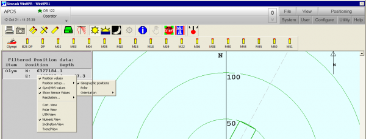

#### ZDA and PPS

An NMEA ZDA message and PPS pulse should be output from a GPS receiver and inputted to APOS via either serial COM port or ethernet port.

1. Select **Configure > External Interfaces**. Right click on External Interfaces and select **Add NMEA**.
2. Right click on the ZDA input and rename it to something logical.
3. The PPS pulse should be interfaced to the ZDA COM port on **pin 8**.
4. If the IOserver is not already running, right click on the ZDA input and select **Activate IOserver**. Configure the COM port settings.
5. Click **TimeSync** and select **NMEA ZDA** and **1 PPS**. If configured correctly, the Time Sync Status indicators should flash blue and green.

    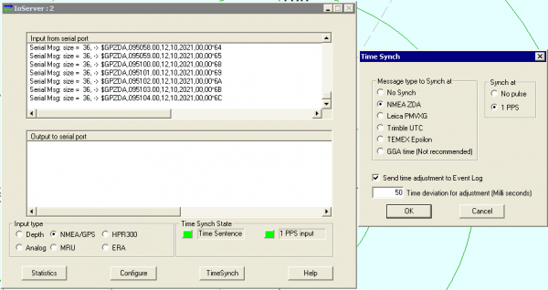

!!! warning
    The system will only accept time sync sentences that are within one hour from the current system time. If the deviation is more than one hour, set the system time approximately first.

### Heading and Motion Inputs

Heading and motion from survey-spec sensors should be configured in APOS. Common options are Applanix POS MV or Kongsberg Seapath heading and attitude systems.

#### POS MV

Make sure output from POS MV to HiPAP is configured properly:

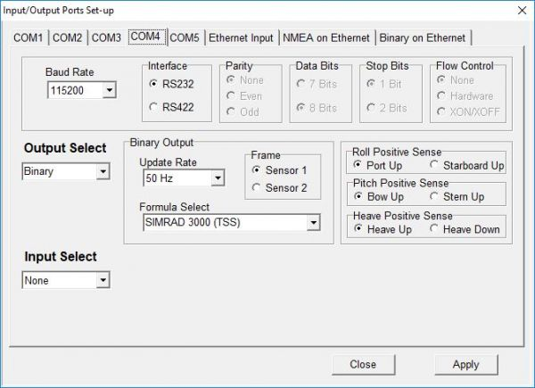

#### Seapath

On the Seapath PC, click **System > Change system mode > Configuration** (password: `stx`). Then click **System > NAV Engine > Standard**. In the NAV Engine configuration window, go to Input/Output and configure the output port with the **EM3000 format**. Both heading and attitude are contained within this message.

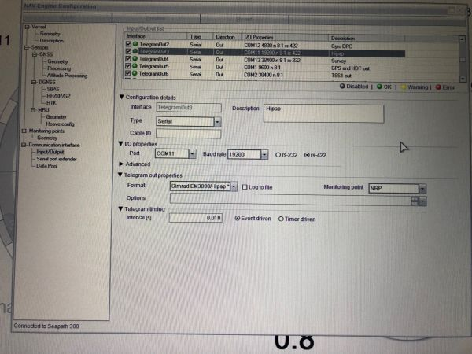

#### APOS Attitude Setup

Once the heading and attitude output messages have been configured:

1. Select **Configure > Transceiver** > relevant HiPAP system > **OK > Attitude**. The software allows for up to 3 heading and motion inputs.

2. For both heading and attitude inputs, select the same format as outputted from the sensors, give them a logical name and configure the serial or network port settings. Green status = correctly configured. Red status = data received but not recognised.

3. **Disable the Auto tick boxes** for both heading and attitude so APOS will not switch to secondary sensors if connection with primary sensors is lost (important for calibration integrity).

    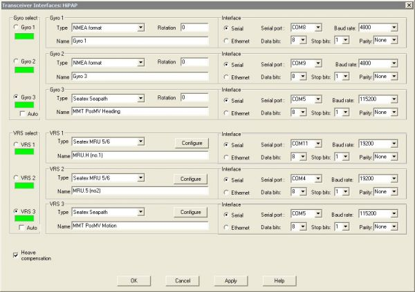

### Outputs

Make sure output to QINSy/NaviScan is configured according to the driver in use. To configure: **Configure > Outputs > NMEA Positions tab**, right click on output > **Configure**. Output can be via Serial or Network.

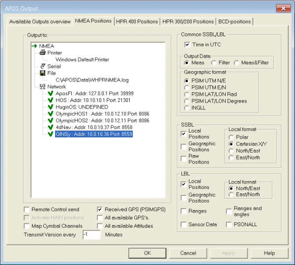

To create a new output: **Configure > Outputs > NMEA Positions tab**, select Serial or Network, then right click > **Add output**.

### Import SVP Profile

!!! warning "Critical"
    Speed of sound in water has a critical influence on transponder position calculation. Make sure the newest sound velocity profile (SVP) is in use.

To update SVP in APOS:

1. Open **Sound Velocity Viewer**

    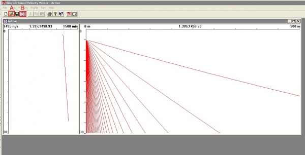

2. Click **Open** and browse to the SVP file location

    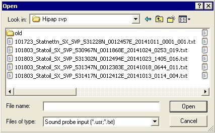

3. Once imported, click **Activate**

---

## :material-monitor-dashboard: Survey APOS

!!! info "Requirements"
    APOS Survey requires HiPAP Mk II transceivers running HiPAP SW version 2 or newer. The onboard system must run APOS version 4 or newer.

APOS Survey makes it possible for surveyors to utilise a vessel's HiPAP system. Acoustic interrogations are interleaved or run simultaneously with the DP system updates, without having to make changes to the vessel's APOS software or installation parameters.

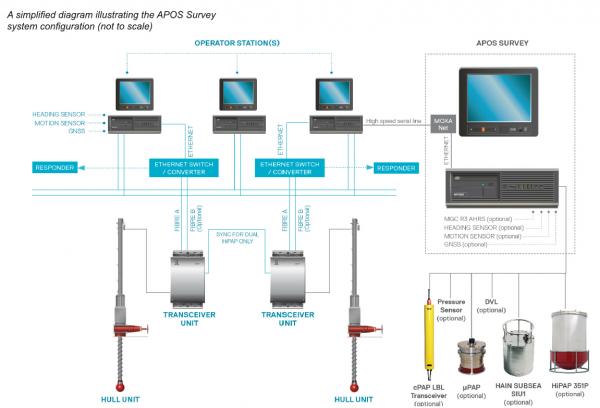

### APOS Survey Interface (ASI)

A small program called ASI (APOS Survey Interface) must be installed on the existing vessel's APOS system. This program must be kept running at all times to maintain communication between the two systems. ASI transfers settings from the onboard vessel system to APOS Survey, but **not** the other way. It also enables APOS Survey to communicate with the onboard transceivers.

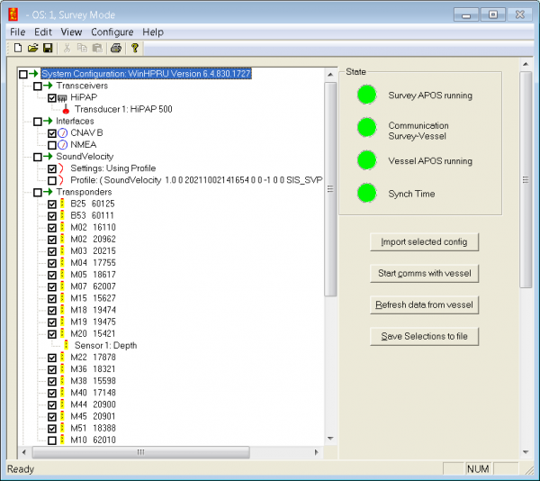

### Start APOS Survey

The recommended startup procedure:

1. On the main system, start APOS if not running
2. Start ASI on the main system
3. Start only the ASI program on the APOS Survey
4. Select which settings to be transferred from the onboard APOS
5. Press the **Import selected config** button
6. Start APOS

!!! tip
    It is possible to configure APOS so that ASI starts automatically. In APOS menu **Configure > User options**, enable **Start the APOS Survey Interface (ASI)**. Then run Main APOS first, followed by APOS Survey -- ASI will start on both PCs automatically.

### Using APOS Survey with AUV

#### Outputs to HOS

Create an output to Hugin Operating System (HOS).

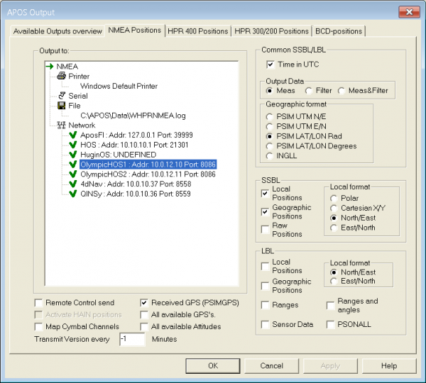

This output will also be used as a link for telemetry transmission between HOS and AUV during mission execution. If using more than one AUV on the project, an output must be created for each vehicle.

#### Modem Settings

To enable telemetry transmission the modem needs to be configured. Click **Control > Modem > Properties**:

1. Setup system and transponder used for transmission
2. Click **COM port**
3. Select communication type (same type as for Output)

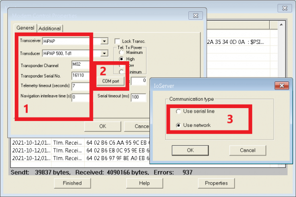

Setup network/serial settings for the communication link. IP address should be the HOS IP -- for available ports ask the AUV team.

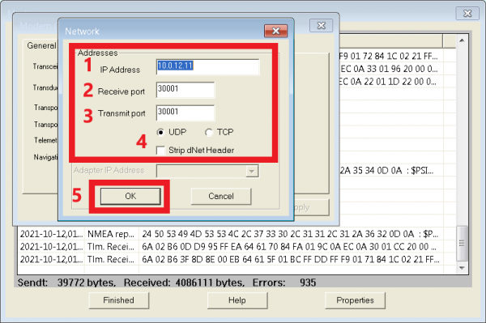

!!! info
    If using multiple AUVs, you'll need to switch between them for handshakes (position updates). The modem settings must be changed for every AUV that needs to be updated.

---

## :material-lifebuoy: Search and Rescue (SAR) - Emergency Locator Transmitter

HiPAP and CPAP can be used as an Emergency Locator Transmitter (ELT) for emergency beacons using a frequency of **37,500 Hz**. This should also be possible with USBL units from other manufacturers.

Setting up the ELT function in APOS:

1. Click **Add new beacon**

    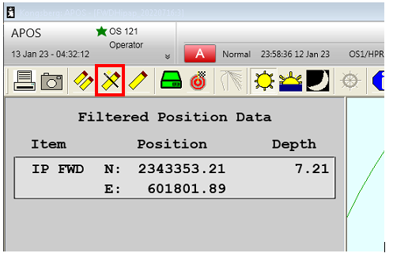

2. Select **Multifunction Positioning Transponder (MPT)** as the type. After this, it will be possible to pick **EMA** and **EMB** in the Channel dropdown menu. Serial number should be unique and not used by another beacon currently in APOS. **Beacon/Pinger** should be ticked on.

    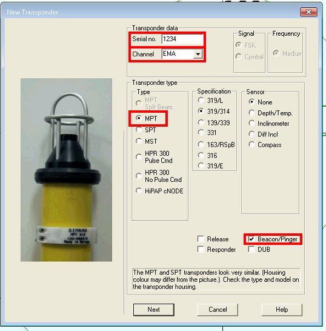

3. Select **All other NON DP use (Mobile)**

    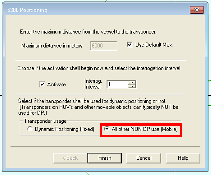

4. In the properties after creating the EMA or EMB beacon:
    - Depth should be **Z-locked** and the depth of the emergency beacon should be input
    - External sensor should be set to **Manual**
    - The **Pulse Repetition Rate (PRF)** of the emergency beacon should also be specified

    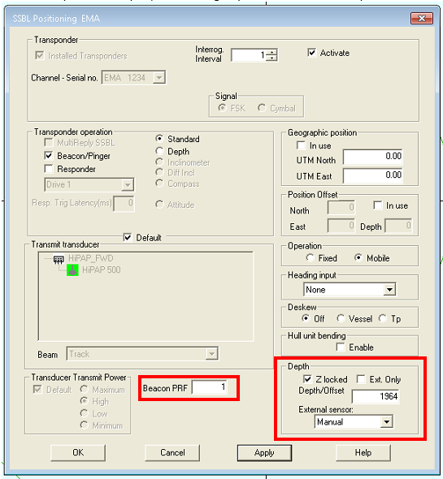

Both EMA and EMB are setup the same way -- the only difference is the serial number. They can be activated as a normal beacon and should give the position of the emergency beacon.
