# :material-compass: PHINS/ROVINS Operations Guide

<div class="page-meta" markdown>
<span class="meta-item">:material-tag-outline: <strong>Equipment</strong></span>
<span class="meta-item">:material-format-list-checks: <strong>Operations Guide</strong></span>
<span class="meta-item">:material-calendar: <strong>2026-03-02</strong></span>
</div>

!!! abstract "Purpose"
    Operational guide for iXblue (Exail) PHINS and ROVINS subsea inertial navigation systems. Covers iXRepeater software, system startup and alignment procedures, post-processing data logging, internal offsets and coordinate conventions, filtering settings, QINSy driver configuration, and Edgetech subsea navigation integration.

---

## :material-information-outline: Summary

PHINS and ROVINS are subsea inertial navigation systems (INS) from iXblue (now Exail) providing subsea vehicles with position, true heading, attitude, speed and heave.

The INS system calculates an accurate position using internal gyros together with external DVL and USBL or GPS input for aiding.

---

## :material-application-cog: iXRepeater

iXRepeater is the main software used to control and keep a good overview of the INS system. Port settings, offsets and filtering can be controlled from this interface.

### Connection

iXRepeater connects using either COM-port or Ethernet. Usually COM-port has been preferred for PHINS systems and Ethernet for ROVINS systems.

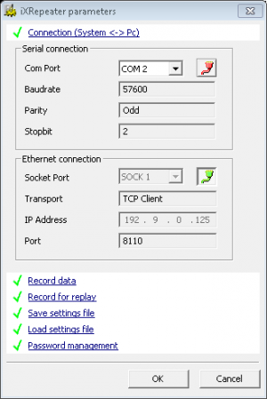

!!! warning "VLAN Requirement"
    The ROVINS needs to be run on its own **dedicated VLAN**, as any additional traffic can cause connection issues.

### System Overview

The main screen of a healthy and fully aligned system running subsea in Navigation mode should look as the screenshot below. It is critical that the following statuses are marked **green**:

| Status | Meaning |
|---|---|
| **System OK** | Expand to check all input/output are green, verify "Navigation Mode" |
| **DVLBT detected** | Bottom speed from DVL is being acquired and used |
| **Depth detected** | Water depth from QINSy is acquired and used |
| **USBL detected** | USBL position from QINSy is acquired and used |
| **Altitude detected** | Height in USBL position from QINSy is acquired and used |
| **UTC/PPS synchro** | ZDA and PPS pulse from POS MV is acquired and used |
| **CTD detected** | Water depth and sound velocity from QINSy is acquired and used |

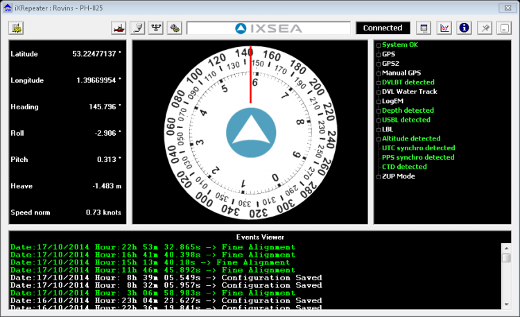

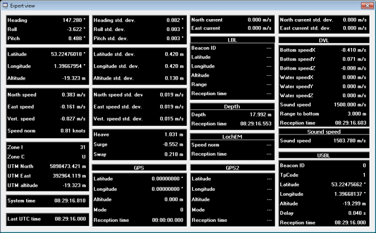

---

## :material-rocket-launch: Startup Procedures

### Step-by-Step

1. Make sure:
    - Vehicle is stationary or at very low speed for faster alignment
    - Haliburton SAS driver in QINSy outputs GGA or USBL position
    - Vehicle depth and SV sensor is switched on
2. Turn on power to PHINS/ROVINS
3. Connect using iXRepeater or Web interface to verify system status
4. Start DelphINS logging one minute after startup
5. Wait for coarse alignment to complete before any activity is started
6. Perform heading changes (step pattern or figure 8) until fine alignment is completed before any MBES operation is started
7. Leave system on and continue logging for about 20 minutes after MBES operation is completed

### Important for Shorter Alignment Time

- Always make sure all sensors are on prior to ROVINS realignment (MiniSVS, MiniIPS or equivalent). Make sure ROVINS receives all aiding data when alignment is initialised.
- To ensure correct GPS quality factors during alignment, use the **manual quality settings** in the QINSy Haliburton SAS driver for both deck and USBL positioning.

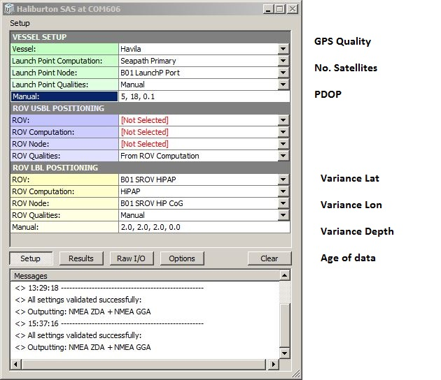

- All INS systems should be aligned while stationary (on deck or with ROV on seabed/position hold)
- Alignment movement options: figures of 8, steps, stationary 180° spins every couple of minutes

### Alignment Steps

The INS navigation sequence is made up of four steps:

1. **INS start**
2. **Coarse alignment** (5 minutes)
3. **Fine alignment** (20 minutes)
4. **Navigation mode**

### Coarse Alignment

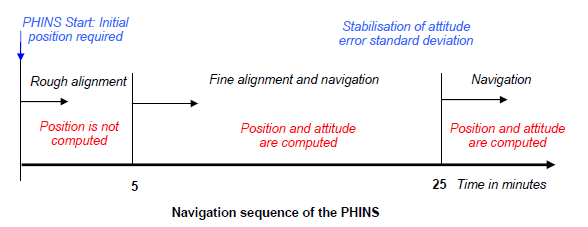

During the first five minutes after powering-on, the system performs coarse alignment: system inertial sensor data (accelerometers and gyrometers) are computed to estimate heading, roll and pitch angles.

!!! warning
    During coarse alignment, keep the system as steady as possible (deck or seabed). No estimation of position or speed is done by the system -- external sensor data is used directly. Heading and attitude are flagged as **invalid** during the entire coarse alignment phase.

### Fine Alignment

After the five-minute coarse alignment phase, the system is ready for navigation. The Kalman filter is activated to compute and estimate position and speed with optimal accuracy.

It is now OK to launch the vehicle. Any movement is allowed during fine alignment. **90-degree rotations** are recommended so the Kalman filter assesses the sensor bias on different axes.

The diagram below indicates the optimal tracks to reduce heading SD in the fastest way possible. It was noted that after reducing the heading SD to 0.25°, becoming stationary for a period drops the SD faster.

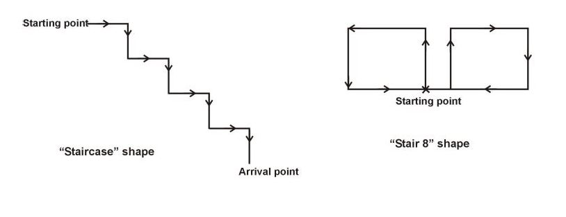

Fine alignment ends automatically when the heading covariance is below **0.1 degree**.

### Navigation Mode

At the end of the fine alignment process, the system is ready for navigation with optimal performance. During navigation, the system uses its own inertial sensors together with USBL to provide optimal estimates of position, speed, attitude and heading.

---

## :material-file-document-outline: Post Processing Log Files

All data from the system can be logged for post processing of position and attitude data. Raw data from DVL, GPS/USBL, depth sensor and INS data is stored and the INS filtering can be adjusted and processed offline using **DelphINS** software.

!!! danger "Critical"
    Save a system settings text file. Without this file, offline post-processing using DelphINS is **impossible**. Settings can be saved from the "Parameters" window in iXRepeater or Setup > Settings Management in the Web interface.

### Using iXblue Multilogger (Preferred)

The preferred and most stable method for logging post-processing data for all iXblue systems. Can log over TCP (now standard) and serial.

### Using Serial Logger

If post processing data is logged using a serial port, one of the output ports needs to be configured with:

- Protocol: **POSTPROCESSING**
- Lever arm: **Primary**
- Rate: **50 Hz**
- Physical link: **Serial Only**
- Baud rate: **115,200**

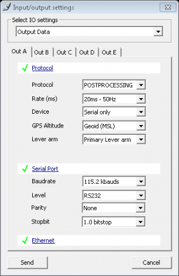

The Serial Logger software runs through a simple terminal window and can be configured for port settings and file name/folder using keyboard commands. When configured, settings can be stored and you just press **L** to start logging.

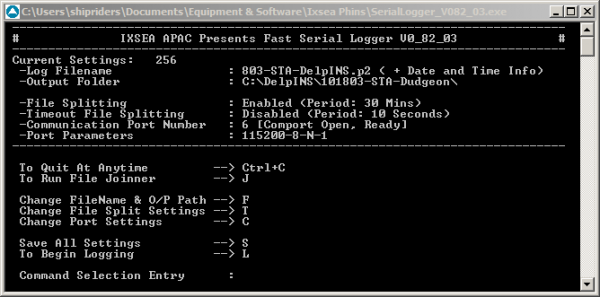

!!! tip
    You can paste the file name into Serial Logger by right clicking the SerialLogger icon on the top left, go to "Edit" and then paste the default location. Ensure to add a `\` at the end of the location.

### Using Web Interface (ROVINS Only)

When using ROVINS, post processing data can preferably be logged over the Ethernet port. Configure:

- Protocol: **POSTPROCESSING**
- Lever arm: **Primary**
- Rate: **50 Hz**
- Physical link: **Ethernet Only** (to decrease load on RS232 port)

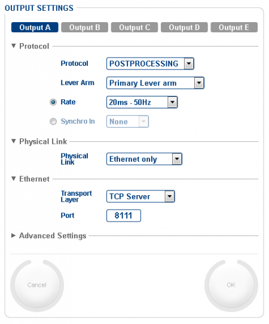

Select **DATA LOGGING** from the Web interface menu and choose the same output as specified in the Output settings. Segmentation is usually set to **30 minutes**.

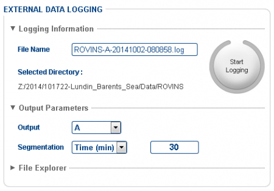

!!! warning
    Always leave browser window open! Also double check that logging is set to 30 **minutes** and not 30 **kB**.

---

## :material-axis-arrow: Internal Offsets

The number of internal offsets added to the PHINS/ROVINS should be kept to a minimum to make it easy to configure and move between vehicles.

### Offsets That MUST Be ZERO

- Main lever arm
- GPS lever arm
- USBL lever arm

### CRUCIAL Offsets for Accuracy

- INS orientation and vessel misalignment
- Pressure sensor lever arm
- DVL lever arm + angular misalignment (see DVL calibration)

### Optional Offsets (External Equipment)

- Secondary lever arm A -- e.g. offset to Edgetech sidescan transducers

### Coordinate Conventions

| Axis | Convention |
|---|---|
| XV1/LV1 | Positive Forward |
| XV2/LV2 | Positive Port |
| XV3/LV3 | Positive Upwards |

### Offsets Using iXRepeater

Offsets are added under **Lever arm settings**:

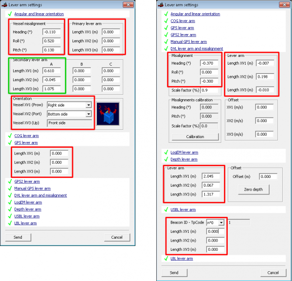

### Offsets Using Web Interface (ROVINS Only)

When configuring the ROVINS, the Web interface is preferable as it has a dynamic graphic layout which gives a good overview of offsets and their conventions. It is also easier to find the correct unit orientation.

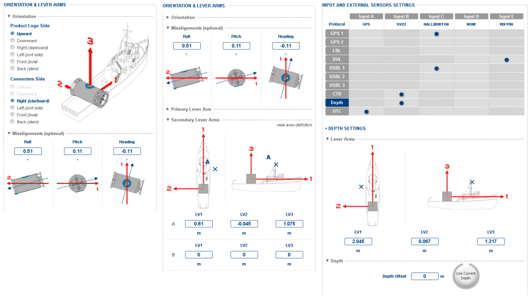

---

## :material-filter-cog: Filtering Settings

### Rejection Filter Mode

For each input (GPS, USBL, DVL, Depth sensor), there is a **Rejection filter mode** option. This should **always** be set to **Automatic reacquisition** while operating. Other settings such as "Always true" can be used to force the INS to follow any input when necessary.

!!! info
    These filter settings are found under External sensor settings in iXRepeater but are **not available** in the Web interface.

### ZUPT Mode

If the INS behaves strangely and moves away at high speed without reason, try setting the unit in **ZUPT** (Zero Velocity Update) mode:

- **Static 0.1 m/s**: generates a fake velocity sensor that sends 0 m/s with a SD value of 0.1 m/s, set to always true

ZUPT settings are found under System tools in iXRepeater or Setup > Navigation Parameters in the Web interface.

### Advanced ROVINS Filters

The ROVINS firmware provides very useful positioning filter settings:

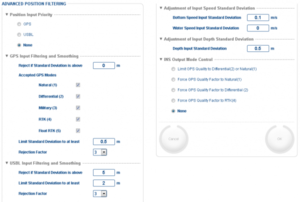

| Setting | Description |
|---|---|
| **Position Input Priority** | When both USBL and GPS are received, select which to prefer |
| **Reject if SD above** | Reject GPS/USBL when SD exceeds this value (0 = disabled) |
| **Limit SD to at least** | Set minimum SD that INS uses for GPS/USBL input |
| **Bottom Speed Input SD** | Trust in DVL speed -- set low (< 0.1 m) for high DVL weighting |
| **Depth Input SD** | Normally 1-2 m for standard operation. For OSS surveys, set to 0.1 m |

---

## :material-swap-horizontal: DVL Calibration

When the system is mounted on a new vehicle, the DVL alignment always needs to be calibrated. This is fairly quick -- align the INS and run on a straight line so the INS software can calculate the true misalignments of the DVL.

!!! info
    PD6 format is required for the DVL calibration tool in the ROVINS GUI to work. Also ensure recommended versions of Firefox and Java are used.

---

## :material-database-cog: QINSy Settings

### Depth Output

The SVX2 output which contains depth and sound velocity values should be configured:

| System | Output Rate | Notes |
|---|---|---|
| PHINS | 2 Hz | Otherwise weights depth too much |
| ROVINS | 10 Hz | Can increase SD value for depth |

The output node in QINSy should be the pressure sensor.

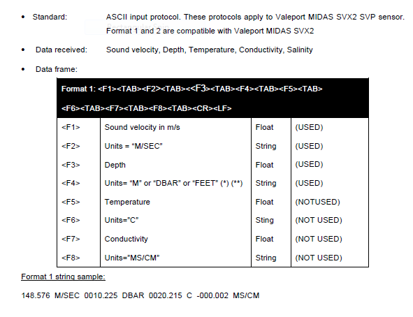

!!! warning
    Incorrectly setup output string from QINSy has been seen to parse pressure/depth to feet. Make sure to have a `<tab>` after the pressure/depth unit.

### Haliburton SAS

The Haliburton SAS driver sends GPS or USBL position from QINSy to the INS:

- **Above surface**: output set to **GGA**
- **Subsea**: output set to **PUSBA**

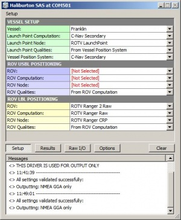

!!! info "Output Node Configuration"
    - The "Vessel Positioning System" must be set to something **other than POS MV** for the INS to accept the deck position
    - The "ROV Node" must be chosen such that the outputted position is computed at the same node as the INS centre reference point

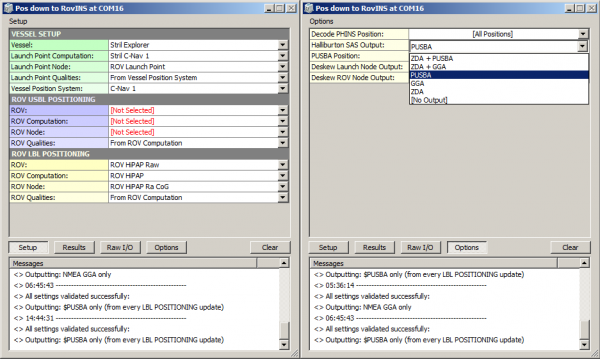

!!! danger "WARNING: Deskew Setting"
    Deskew under Options in the Driver **must** be set to **No**. Setting deskew to Yes will skew the position from source datum to survey datum. There will be no compromise by not deskewing since USBL positions are sent on each trigger time.

### Computation Setup

Standard deviation value of the USBL position can be added manually in the computation setup. This value is used by the INS to determine how much to trust the USBL position.

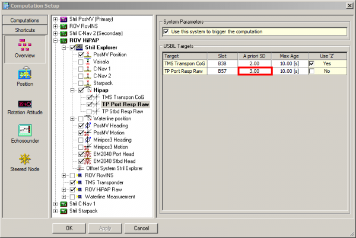

!!! info
    The SD value should be at least **0.02% of the slant range**, but often higher due to unreliable USBL solutions. The accuracy is sent to the INS in the PUSBA message as **variance** in metres (Variance = SD²).

---

## :material-ethernet: Position and Motion to Edgetech

iXblue's Binary Nav protocol parser in Edgetech sonar software enables sending navigation and attitude data subsea from INS to the Edgetech system. This minimises serial connections and related latency problems. It also brings the vehicle depth into the SB data, which is useful for post processing.

### INS Settings

1. Add Secondary lever arm for Edgetech sidescan transducers
2. Configure output port for **NAV BINARY**, **5 Hz**, and **Secondary lever arm**

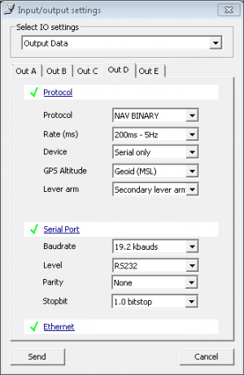

### Deck Operations

!!! warning "Depth Sensor on Deck"
    When the ROV is on deck, the depth sensor can easily be rejected and the altitude of the ROVINS might accelerate away. If it gets too far gone:

    1. Try switching altitude off of the depth sensor, select GPS input "send", then set back to depth sensor and "send"
    2. If this does not work, restart the system

    **Prevention**: Set depth input to **Always True** when on deck, then return to **Automatic reacquisition** when subsea.

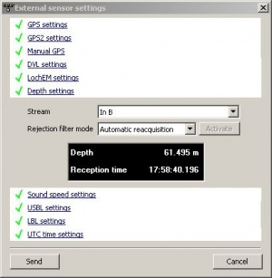

### Edgetech Settings

On the sonar embedded PC, add the following to `SonarSerial.ini` (Serial1 must correspond to the correct serial port):

```ini
[Serial1]
Create=1
Baud=19200
Parser=17
```

All serial navigation inputs on topside can be disabled in Discover SS/SB. Position and motion data from INS should show up after software is rebooted.

---

## :material-map-marker: UTM Zones

The ROVINS uses projected coordinates in some output protocols. The unit will automatically select the UTM zone based on the current position.

**View active UTM zone:**

- **iXRepeater**: Expert view > Zone 1 [UTM Zone]
- **WebGUI**: Option page > Coordinates, select UTM > Control page displays UTM Zone in top right corner

### Manually Selecting a UTM Zone Outside Current Position

There is no built-in feature to manually select a desired UTM zone. However, there is a workaround:

1. Untick the **Extend current UTM Zone** tick box under Navigation parameter page
2. Disable any GGA or PUSBA output to the ROVINS
3. Under **Setup > Position Fix**, enter a coordinate from inside the chosen UTM Zone and change the UTM Zone box
4. Click **Replace By Current Position**
5. Go back to Navigation parameter page and tick the **Extend current UTM Zone** tick box
6. Enable your GGA/PUSBA output and verify that the ROVINS stays in the desired UTM Zone
7. Use the Force GPS mode and enable ZUPT mode to force the ROVINS back to correct position
