# :material-navigation: Sprint INS Operations Guide

<div class="page-meta" markdown>
<span class="meta-item">:material-tag-outline: <strong>Equipment</strong></span>
<span class="meta-item">:material-format-list-checks: <strong>Operations Guide</strong></span>
<span class="meta-item">:material-calendar: <strong>2026-03-02</strong></span>
</div>

!!! abstract "Purpose"
    Operational guide for the Sonardyne Sprint AHRS/INS system. Covers the Lodestar Communication Hub (LCH) utility, Sprint software configuration, startup procedures, system offsets, DVL alignment and calibration, QINSy driver settings, angular rate filtering, Edgetech integration, factory reset procedures, internal log file recovery, and troubleshooting.

---

## :material-information-outline: Summary

Sprint is an Altitude and Heading Reference System (AHRS) / Inertial Navigation System (INS). It consists of **3 ring laser gyros** and **3 linear accelerometers** to produce accurate real-time motion and attitude measurements when interfaced with USBL, DVL, Pressure Depth and external position.

The Sprint is usually interfaced with the **Syrinx DVL**.

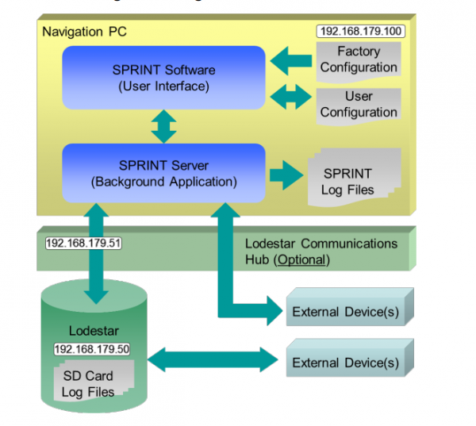

---

## :material-console: Lodestar Utility

To connect to the subsea unit using serial COM, use the Lodestar utility through the **Lodestar Communication Hub (LCH)** topside computer. This allows changing of configuration I/O via Ethernet and Serial and to see the status of the subsea unit.

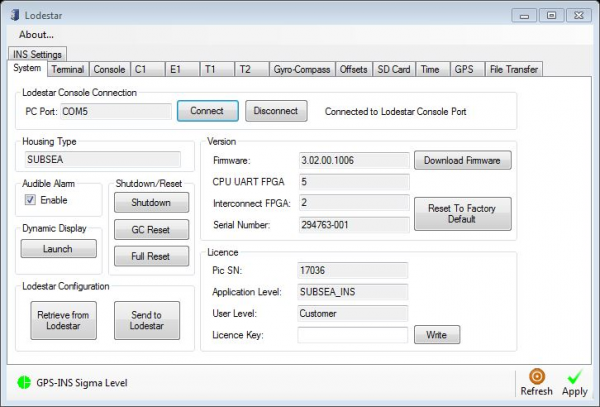

The Lodestar Utility when connected via serial to Subsea Lodestar:

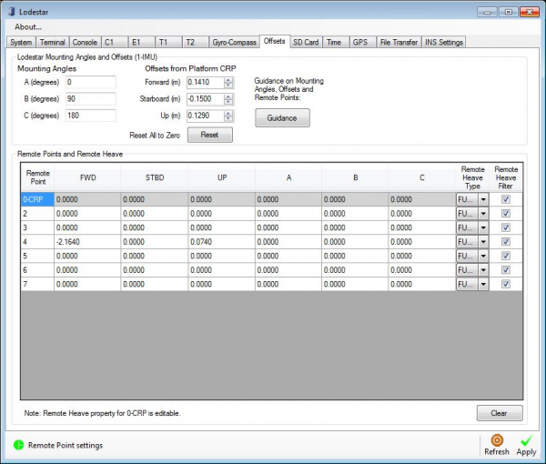

Offsets are entered as per the requirements of the configuration. In this example the SSS CRP is configured under column 4.

### E1 Port Configuration

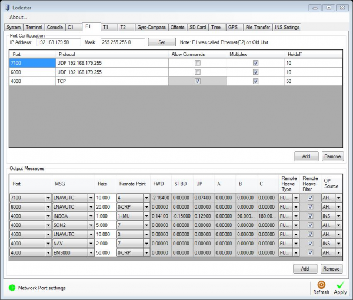

UDP broadcast messages are sent via the E1 port. Message type and remote point can be defined here (e.g. messages to QINSy, NaviScan, SIS, Discover).

The port 4000 messages are the communication via TCP with the LCH unit.

!!! warning
    Adjustments to UDP outputs should be made in the **Lodestar Utility** and **not** in the Sprint software.

### Autotrack Configuration

The T1 tab LNAV output is used for autotrack using the ROV control container. This message must be **Multiplexed** to work. This can be ticked in on the Lodestar control page but is not displayed via the Sprint GUI. To apply through the Sprint GUI, enter these commands in the Sprint terminal:

```
OP 1 MULTIPLEX 1
SYS SAVE FLASH
```

When using autotrack, an angular speed filter correction needs to be applied to improve stability:

```
IMU ANGFILT 0.05
SYS SAVE FLASH
```

T2 outputs motion to SIS using a modified Ethernet cable.

---

## :material-alert-circle-outline: Issues with Loading Lodestar Configuration

!!! warning "Known Issues"
    - Manual changes to port settings in the Lodestar Utility can be dropped
    - Changes in the Sprint software may have no effect on the Lodestar, leading to situations where settings appear correct but data is not decoded correctly

### Workaround

1. Use the **Retrieve from Lodestar** command to obtain the command file (`LodestarCmdList.txt`)
2. Use this file under **Send to Lodestar** to upload (or after a factory reset)
3. If there are a large number of I/Os, this has been known to take **1 hour** to complete

!!! danger "Important"
    After uploading is complete, there is usually an error message reporting that a number of commands have failed. **Go through and check all offsets and I/Os** of all systems against screenshots for calibration and lever arm values as they are not always carried through.

---

## :material-application-settings: Sprint Software

The Sprint software allows interfacing of all peripheral sensors, Navigation Data Logging, and provides a GUI for the current status of the unit.

### Connection

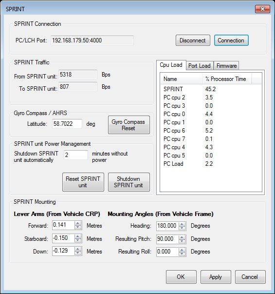

The Sprint connects via PC/LCH port via TCP connection. Lever arms of Vehicle CRP and orientation mounting angles are set on this page.

!!! info
    The mounting angles do not currently support values greater or less than 90 degrees of pitch. Small offsets of mounting angles are therefore applied in QINSy and NaviScan to account for this.

### INS Input Settings

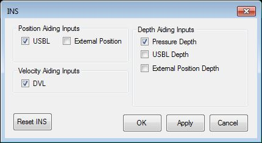

Here it is possible to define which inputs the INS uses to create its navigation solution. Changes can be made if the system "runs off" or a sensor fails while in operation.

### USBL Aiding

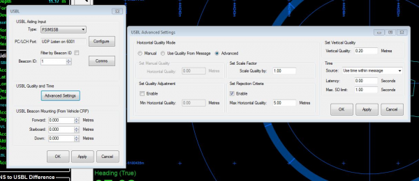

The USBL aiding input screen allows setting the beacon location depending on system configuration. If QINSy is sending the location of the beacon to the CRP of the Sprint unit, all values are set to zero.

!!! tip
    The USBL advance settings allow configuration of the quality value. Increase the quality value if USBL data is being rejected consistently by the Sprint.

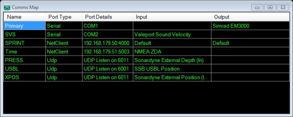

### Quality and Status

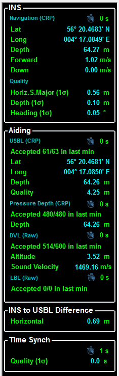

The left side of the Sprint software provides information about positioning quality. The Sprint takes approximately **5-10 minutes** to reduce heading standard deviation to below 0.05° after executing "Reset INS". Sharp heading changes speed up the SD reduction.

The USBL Aiding is sent via the ROV computation in the QINSy driver. This can be adjusted to a manual value as per survey requirements.

---

## :material-rocket-launch: Startup Procedures

1. Power via the ROV control panel
2. Start the Sprint software and connect to the subsea unit
3. The **Reset INS** solution may need to be pressed initially to reset all navigation states
4. To power the integrated Syrinx DVL: **Configure > Power Pass Through** and tick DVL

---

## :material-file-document-outline: Post Processing Log Files

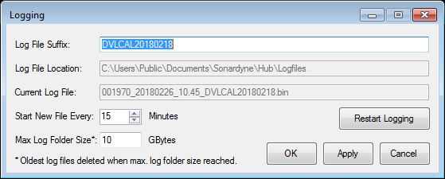

System logging can be set up for post-processing navigation data and to complete a DVL calibration using the **Janus** software.

---

## :material-axis-arrow: System Offsets

| Offset Type | Where Configured |
|---|---|
| Beacon offsets | QINSy database |
| Initial mounting angles, lever arms to CRP, depth sensor/SVP/DVL offsets | Sprint software |
| Output lever arms (e.g. SSS reference point) | Lodestar Utility |
| Small mounting angle adjustments | NaviScan and QINSy |

---

## :material-swap-horizontal: DVL Alignment and Calibration

The Sprint manual provides clear instructions for the DVL procedure (Section 6.1.1). The manoeuvres do not have to be followed exactly -- running from a point A to B and then in reverse can also produce satisfactory results.

### SprintNav (Integrated INS and DVL)

When using the SprintNav, factory misalignments between the MRU and DVL need to be accounted for. These should be provided by Sonardyne. If not, contact Sonardyne and they will provide a `.txt` file which can be loaded into the terminal command.

You can edit this file adding your misalignments from the SprintNav to the vehicle reference frame. Make sure to check the **sign convention** of angular rotations. Save the edited file with a different name to preserve the original.

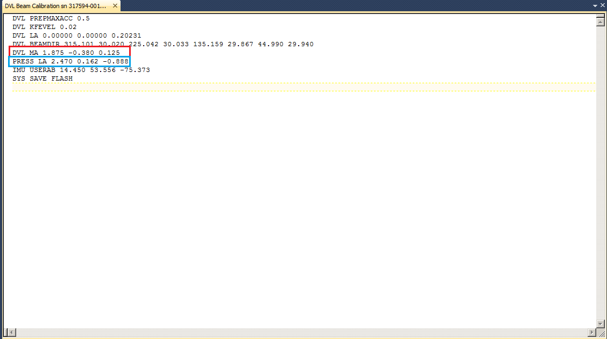

!!! warning "Offset File Contents"
    The file contains both DVL angular misalignments and pressure sensor offsets. If the pressure sensor offsets differ from your dimcon values and you load the file, your pressure sensor offsets **will change**. Update the pressure sensor offsets in the file to match your values before loading. **Always double-check in the GUI after the file has been loaded.**

---

## :material-database-cog: QINSy Settings

The QINSy driver used is the **Sprint LNAV PPS**, which decodes the Sprint LNAV UTC message at **20 Hz**. This is used to decode:

- Gyro
- Motion
- Sprint Depth/Altitude
- Sprint Position
- Sprint PSIMSSB

Sprint PSIMSSB outputs on the incoming Sprint position port **+1**. For example, if Sprint Position is on port 6000, PSIMSSB would be on port **6001**. This is defined as the receiver number in the database setup.

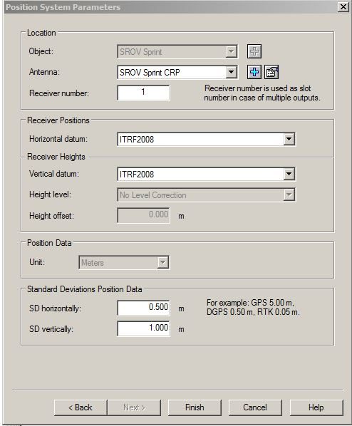

Note the Receiver number is set to 1:

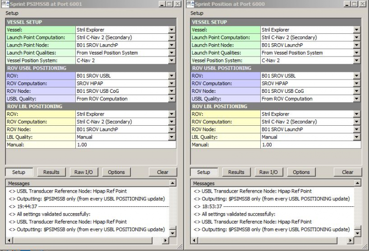

Driver setup for port 6000 and 6001:

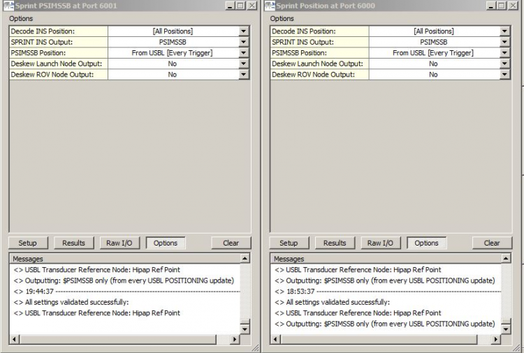

!!! warning
    **Deskew ROV output** outputs the data in the **Survey Datum**, not the Sprint's Receiver Position. Be aware of this when configuring.

    USBL: **Every Trigger** when the unit is subsea, **LBL** when the unit is in the deck position.

---

## :material-calculator: Computation Setup

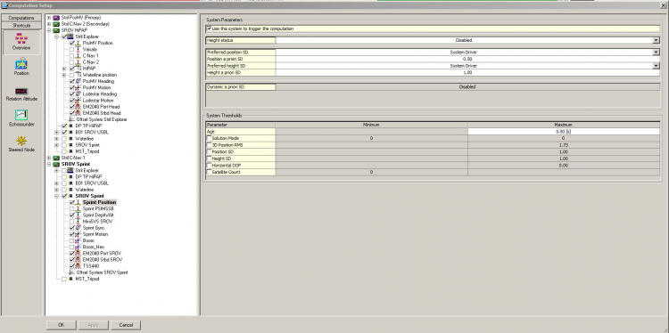

---

## :material-sine-wave: Angular Rate Filter

Angular rate filter is enabled by default. It can be configured using the command in the Sprint terminal window:

```
IMU ANGFILT <value>
```

For example:

```
IMU ANGFILT 0.01
```

By default the filter is set to **0.01 seconds** which removes the vast majority of vibration picked up by the unit without introducing significant latency.

For the ROV control system, try **0.02s**.

To save changes:

```
SYS SAVE FLASH
```

---

## :material-file-settings: Edgetech .ini File

The .ini file in the subsea bottle needs to be changed to accept the LNAV UTC message from Sprint. Configure the output in the Lodestar utility and use the SprintUDP.ini template to decode the message in the remote Edgetech computer.

---

## :material-restore: Factory Reset

At times a Factory Reset of the Lodestar will need to be undertaken. This can be difficult -- follow the documented procedure carefully as a guide.

---

## :material-folder-download: Internal Log File Recovery

It may be necessary to recover the internal log files from the Sprint unit. Since the system runs through the LCH via serial, you will need to:

1. Disconnect the Sprint in the normal Sprint software

2. Connect in the Lodestar Utility using **IP 192.168.179.51**, **Port 5001**

    !!! tip
        Instead of pressing OK, press **Detect port** -- this scans and finds the correct settings. This method is also recommended by Sonardyne.

    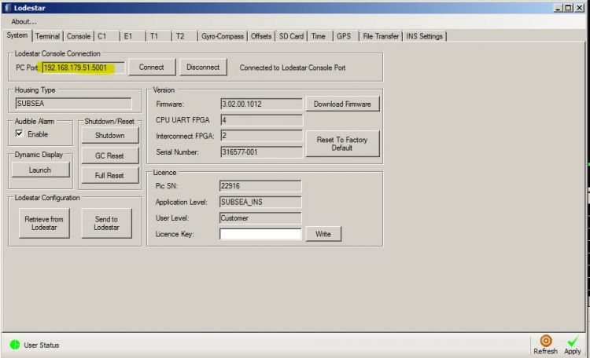

3. Disable **multiplex** on the console port (remember to enable it afterwards). Press Apply to confirm settings.

    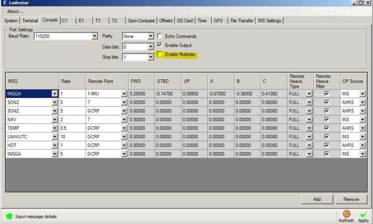

4. Locate the **File transfer** tab. Select the directory you wish the files to be saved to. Navigate to the date you're looking for and select the file. Press **Upload to PC**.

    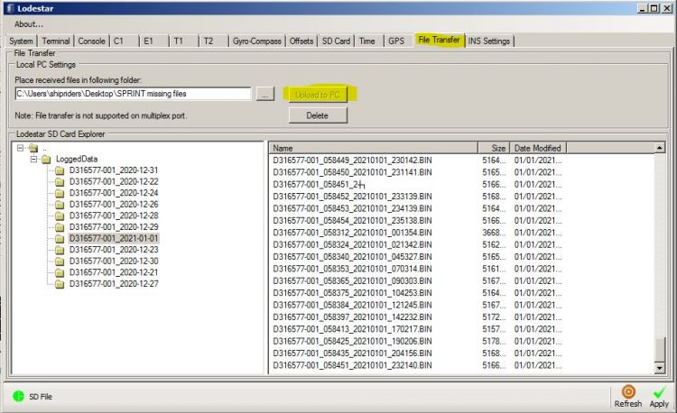

    !!! info
        If the progress bar does not move, close the Lodestar config software and reconnect.

5. Once you have the required files, re-enable multiplex on the console port.

---

## :material-alert-outline: No Response After Incorrect Shutdown or Firmware Update

If the Sprint is not shut down correctly and goes to battery mode, then the battery runs out (or the set limit is reached), the unit can become inaccessible.

### Standard Recovery

1. Connect to CP on **9600 baud** in TeraTerm or HyperTerminal
2. Send `UNLK`

### Recovery After Failed Firmware Update

If the unlock command works but the boot sequence fails:

1. Connect to CP on **9600 baud** in TeraTerm or HyperTerminal
2. Send `UNLK`
3. Whilst the firmware loads and dots appear, press ++ctrl+o++ and then type `SON`
4. At the `Lodestar>` prompt, type:
   ```
   LOADHEX CLRFLASH.HEX
   ```
5. The unit should boot up again (1-2 minutes). It will have reset to factory defaults, and the Console Port will be on 9600 baud rate.

---

## :material-sd: Save C1 to SD for Sonardyne Analysis

To configure the SD card with C1 output, enter the following in the Sprint software terminal:

```
OP SD MSG + NAV 5.000 RP 3 SRC 1
SYS SAVE FLASH
```
