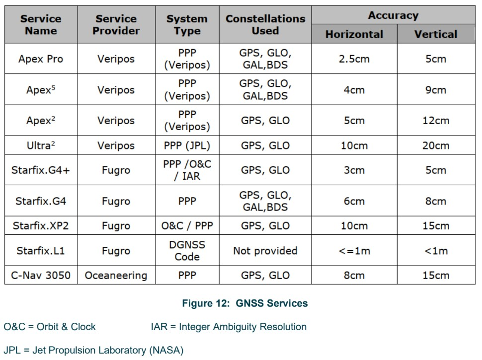

# :material-satellite-variant: GNSS Fundamentals

:material-tag-outline: <strong>Positioning</strong>
:material-format-list-checks: <strong>Reference Guide</strong>
:material-calendar: <strong>2026-03-01</strong>

!!! abstract "Purpose"
    Comprehensive reference covering GNSS constellations, position computation theory, error sources, augmentation systems (DGNSS, PPP, RTK), antenna installation requirements, calibration/verification methods, and quality control statistics. Intended as a foundation document for surveyors working with satellite-based positioning systems offshore and onshore.

---

## :material-satellite-variant: GNSS Constellations

Modern GNSS receivers can simultaneously use satellites from multiple constellations, increasing the number of visible satellites at any given time, improving positioning geometry and providing increased redundancy.

| Constellation | Operator | Satellites | Orbit Altitude | Coverage | Frequencies |
|---|---|---|---|---|---|
| **GPS** (NAVSTAR) | United States | 31 (24+ operational baseline) | 20,200 km | Global | L1 (1575.42 MHz), L2 (1227.60 MHz), L5 (1176.45 MHz) |
| **GLONASS** | Russia | 24 (22 operational + 3 spares) | 19,140 km | Global | L1, L2 (FDMA); L3 (CDMA on newer satellites) |
| **BeiDou** | China | 30 (3 GEO + 3 IGSO + 24 MEO) | Various | Global | B1 (1561.098 MHz), B2 (1207.14 MHz), B3 (1268.52 MHz) |
| **Galileo** | European Union | 27 operational + 3 active spares | 23,222 km | Global | E1 (1575.42 MHz), E5a (1176.45 MHz), E5b (1207.14 MHz), E6 (1278.75 MHz) |
| **QZSS** | Japan | 4 (expanding to 7) | Various | Regional (Asia-Pacific) |  Multiple |
| **NavIC** | India | 7 (3 GEO + 4 IGSO) | Geostationary / Geosynchronous | Regional (India + 1,500 km) | Multiple |

!!! info "Key Takeaway"
    Modern receivers tracking GPS, GLONASS, Galileo and BeiDou simultaneously have far more satellites available than any single constellation alone. This improves positioning geometry and provides redundancy if one constellation degrades.

---

## :material-calculator: How Position Is Computed

All GNSS systems operate on the same fundamental principle: measuring the distance from satellites to the receiver.

### The Four Unknowns

Every GNSS position fix must solve for four unknowns:

1. **Latitude**
2. **Longitude**
3. **Height**
4. **Receiver clock error**

A minimum of **four satellite observations** are therefore required for a 3D position fix.

### Pseudoranges and PRN Codes

Until the receiver clock error is resolved, the measured distances are called **pseudoranges**. The measurement process works as follows:

- Each satellite transmits a **pseudorandom noise (PRN) code** modulated onto its carrier signal
- The receiver generates an internal replica of the same PRN code
- By comparing the time shift between the received code and the replica, the receiver determines the time difference between the satellite's atomic clock and its own clock
- The receiver corrects its clock and calculates the signal travel time

### Position Resolution

- The propagation time multiplied by the speed of light gives the range to each satellite
- Each range defines a sphere centered on the satellite
- With one satellite, the receiver lies somewhere on the sphere's surface
- With two satellites, the position lies on the intersection of two spheres
- With three satellites, a 2D position is resolved (latitude and longitude only -- this requires **height aiding**, i.e. the height must be constrained or assumed, otherwise the solution is underdetermined)
- With **four or more satellites**, a full 3D position is computed using **least squares adjustment**

---

## :material-chart-scatter-plot: Dilution of Precision (DOP)

DOP quantifies how satellite geometry amplifies ranging errors. Poor geometry (satellites clustered together) produces high DOP values and degraded accuracy. Good geometry (satellites well spread across the sky) produces low DOP values.

| DOP Type | Measures | Description |
|---|---|---|
| **HDOP** | Horizontal accuracy | Dilution in the horizontal plane only |
| **VDOP** | Vertical accuracy | Dilution in the vertical direction |
| **PDOP** | 3D position accuracy | Combined HDOP and VDOP |
| **GDOP** | Overall geometric quality | Includes time dilution |

!!! tip "Reducing DOP"
    DOP is reduced by observing as many satellites as possible from multiple constellations. Multi-constellation tracking is the most effective way to maintain good geometry.

---

## :material-alert-circle: GNSS Error Sources

### Satellite Clocks

Atomic clocks aboard GNSS satellites are highly accurate but drift slightly. A clock error of just **10 nanoseconds produces 3 metres of range error**. The ground control segment monitors satellite clocks and broadcasts clock offset corrections as part of the navigation message.

### Orbit Errors

Satellites travel in well-defined orbits but small variations occur. Even a small orbit error produces a large range error. The ground control segment continuously monitors orbits and sends corrections to each satellite, which updates its broadcast ephemeris data.

### Ionospheric Delays

As signals pass through the ionosphere, they are slowed by refraction. Mitigation strategies:

- **Elevation masking** -- reject low-elevation satellites where ionospheric path length is greatest
- **Ionospheric models** -- applied by single-frequency receivers
- **Dual-frequency receivers** -- measure the ionospheric delay directly using L1 and L2 carriers and remove it from the computed position

!!! warning "Limitation"
    Dual-frequency receivers can correct for ionospheric delay but **cannot remove ionospheric scintillation effects** (see [GNSS Jamming and Spoofing](gnss-jamming-and-spoofing.md) for details on Solar Cycle 25).

### Tropospheric Delays

The troposphere (lowest layer of the atmosphere) introduces delays caused by changes in humidity, atmospheric pressure, and temperature. These are handled by:

- **Tropospheric models** built into receivers
- **DGNSS and RTK** systems, where the reference station operates in the same atmospheric conditions as the mobile receiver, effectively cancelling tropospheric effects

### Receiver Noise

Higher-quality survey-grade receivers produce less internal noise. For survey applications, always use high-specification receivers.

### Multipath

Multipath occurs when signals reflect off nearby surfaces (walls, bulkheads, deck structures) before reaching the antenna. Mitigation:

- **Careful antenna placement** away from reflective surfaces
- **High-specification receivers and antennas** with built-in multipath rejection

---

## :material-access-point: Augmentation Systems

### Differential GNSS (DGNSS)

DGNSS uses a **reference station** (base station) at a known, precisely surveyed position:

1. The reference station compares its known position to the position computed from satellite ranges
2. Differences are attributed to satellite ephemeris, clock, and atmospheric errors
3. Per-satellite range corrections are calculated and broadcast to the remote receiver
4. The remote receiver applies these corrections for a more accurate position

DGNSS is effective at minimising most of the errors described above, particularly atmospheric delays, because reference station and mobile receiver share similar atmospheric conditions.

---

### Satellite-Based Augmentation Systems (SBAS)

SBAS systems broadcast GNSS corrections and integrity information via geostationary satellites. They provide metre-level accuracy improvement over standalone GNSS without requiring a local base station.

| System | Region |
|---|---|
| **WAAS** | North America |
| **EGNOS** | Europe |
| **MSAS** | Japan |
| **GAGAN** | India |

SBAS is primarily designed for aviation safety-of-life applications but is also used in marine navigation and low-accuracy survey tasks. It does not achieve the accuracy of PPP or RTK but provides a freely available improvement over standalone GNSS.

---

### Precise Point Positioning (PPP)

PPP is the most widely used system in offshore industry due to its accuracy and **global coverage**.

| Characteristic | Detail |
|---|---|
| Accuracy | Decimetre level (typical) |
| Base station required | No |
| Corrections source | Global network of reference stations |
| Delivery method | Satellite L-band or internet (NTRIP) |
| Convergence | Requires time to resolve ambiguity and local biases |

PPP corrections are generated from a global network of reference stations that compute precise satellite clock and orbit data. These are delivered to the end user, and the receiver uses them to achieve decimetre-level or better accuracy from a single receiver with no local base station.

!!! info "Convergence and Reconvergence"
    A PPP solution requires a period of convergence to resolve for the carrier-phase ambiguity and local biases (atmospheric conditions, multipath environment, satellite geometry). Convergence time and final accuracy depend on the quality of corrections and how they are applied in the receiver.

    **Reconvergence** occurs when a converged PPP solution is disrupted (e.g. by signal loss, ionospheric scintillation, or correction data interruption). The receiver must re-estimate the ambiguities and biases. Typical reconvergence takes **20 to 30 minutes**, though modern multi-constellation services with fast reconvergence algorithms can reduce this. During reconvergence, horizontal accuracy degrades to metre level or worse -- plan critical operations around this limitation.

---

### Real Time Kinematic (RTK)

RTK provides the **highest accuracy**, particularly in the vertical axis, making it essential for projects with tight vertical tolerances such as offshore wind.

| Characteristic | Detail |
|---|---|
| Accuracy | Centimetre level |
| Method | Carrier-phase measurement (1-2 GHz) |
| Base station required | Yes (static, known coordinates) |
| Communications | Real-time data link between base and rover |
| Baseline limit | < 20 km for optimal performance |
| Initialisation | Short initialisation time, then continuous 3D vector |

RTK resolves the integer number of carrier wavelengths between the satellite and receiver antenna, plus the fractional phase at the antenna. This produces accuracy an order of magnitude better than code-based methods.

!!! warning "Critical Dependency"
    RTK requires a **continuous, reliable communications link** between base and rover. Loss of the data link means loss of RTK solution.

---

### Network RTK

Network RTK extends conventional RTK by using a **network of permanent reference stations** rather than a single base station. The network processor models atmospheric errors across the region and generates a virtual reference station (VRS) or area corrections for the rover's location.

| Characteristic | Detail |
|---|---|
| Accuracy | Centimetre level (comparable to conventional RTK) |
| Base station required | No -- uses a network of permanent stations |
| Coverage | Regional (depends on network density and extent) |
| Communications | Mobile data (internet) connection to the network service |
| Key advantage | Eliminates the need to set up a local base station; corrections remain valid over larger areas |

Network RTK is commonly used for nearshore and port surveys, quayside mobilisation checks, and any application where a local base station is impractical but mobile data coverage is available.

---

### GNSS Service Providers and Accuracy

<figure markdown="span">
  { width="600" }
  <figcaption>Comparison of commercial GNSS correction services showing provider, system type, constellations used, and horizontal/vertical accuracy specifications.</figcaption>
</figure>

---

## :material-antenna: Antenna Installation

### Siting Rules

- [x] Sited at the **highest point** on the vessel
- [x] Sited with a **clear horizon** in all directions
- [x] Minimum **1 metre clear** of other GNSS/radio antennas
- [x] Sited **outside the transmission beam** of radar antennas

!!! danger "Obstructions"
    Any obstructions such as funnels, masts, or structural elements will degrade GNSS performance and can cause complete loss of satellite reception.

### Cable Specifications

| Requirement | Specification |
|---|---|
| Cable runs > 20 m | Use **low-loss cable** (recommended for all installations) |
| Maximum cable run | Approximately **100 m** |
| Cable runs > 100 m | Install **inline signal boosters** |
| Interconnections | Minimise the number of joints and connectors |

### Cable Routing

- Avoid routing through hatches or doorways where cables may be pinched or severed
- Secure cables to prevent excessive vibration
- Avoid undue stress on connectors
- Seal all cable/antenna connections against the elements using self-amalgamating tape

### Receiver Placement

- Install in a stable location with ease of access for configuration, operation, and maintenance
- Locate adjacent to the online navigation system
- Provide a display if using a GNSS QC/analysis package

---

## :material-check-decagram: Calibration and Verification

### Static Verification (Total Station Comparison)

Performed while the vessel is alongside a wharf:

1. Configure navigation software to read **antenna position data** (remove CRP offsets)
2. Ensure GNSS correction service is enabled
3. Synchronise observations with navigation software time
4. Mount a **reflective prism** on the mast close to the GNSS antenna
5. Take **total station observations** to the prism from a known reference mark
6. Compare land-based survey results against logged navigation results

!!! note "Datum Consistency"
    It is critical that the calculated antenna position and the observed antenna position are on the **same datum**.

### Dynamic Verification (RINEX Post-Processing)

When static verification is not possible:

- Record **GNSS RINEX data** during operations
- **Post-process** the data to produce a PPP solution
- Compare the post-processed PPP solution against the recorded real-time DGNSS vessel position

Other dynamic checks (vessel comparisons, passing channel markers, transits around structures) can serve as a **gross error check** but are typically only accurate to 5-10 m.

### System Comparisons

After all calibrations are complete with computed-minus-observed values and offsets applied to the CRP:

- Run a **GNSS system comparison** to confirm all independent GNSS systems agree within their operating specifications
- Review both tabular and graphical comparison outputs

---

## :material-chart-bar: QC Statistics

GNSS positions are computed using least squares adjustment. The residuals and covariance matrix from this computation produce test statistics and quality measures for each position fix.

### Test Statistics

| Statistic | Purpose |
|---|---|
| **w-test** | Detect **outlier** observations in the position solution |
| **F-test** (unit variance test) | Verify the **mathematical model** used to account for errors is correct |

### Quality Measures

| Measure | What It Shows |
|---|---|
| **Error ellipse** | Horizontal confidence region for each position fix |
| **External reliability** | 3D positional marginally detectable error -- the smallest error that can be reliably detected |

!!! tip "Monitoring"
    GNSS QC software calculates these statistics in real time and presents them to the online surveyor. Continuous monitoring of w-test, F-test, error ellipse and external reliability is essential during operations.

---

## :material-calendar-check: When to Use

- **Project mobilisation** -- verify GNSS system performance before survey operations begin
- **Equipment selection** -- determine which augmentation system (DGNSS, PPP, RTK, Network RTK, SBAS) is appropriate for the project accuracy requirements
- **Training and onboarding** -- foundational reference for surveyors new to GNSS-based positioning
- **Troubleshooting** -- understand error sources and augmentation limitations when diagnosing positioning issues during operations

---

## :material-check-decagram: Acceptance Criteria

| Parameter | Threshold |
|---|---|
| HDOP | < 2.0 for survey operations; < 1.5 preferred |
| PDOP | < 3.0 for 3D positioning |
| Minimum satellites tracked | >= 8 (multi-constellation) |
| PPP horizontal accuracy (converged) | < 0.15 m (95% CL) |
| RTK horizontal accuracy | < 0.02 m + 1 ppm of baseline (95% CL) |
| RTK vertical accuracy | < 0.03 m + 1 ppm of baseline (95% CL) |
| DGNSS horizontal accuracy | < 1.0 m (95% CL) |
| PPP convergence time | < 30 minutes to reach specified accuracy |
| System comparison agreement | Within operating specifications of each system |

---

## :material-wrench: Troubleshooting

| Symptom | Likely Cause | Action |
|---|---|---|
| High DOP values / poor geometry | Obstructions blocking satellite signals | Check antenna siting; ensure clear sky view in all directions |
| Position jumps or sudden offset | Multipath from nearby structures | Relocate antenna away from reflective surfaces; check for new obstructions |
| PPP not converging | Correction data not being received | Verify L-band demodulator lock; check NTRIP connection and credentials |
| PPP reconvergence taking > 30 min | Ionospheric disturbance or correction interruption | Monitor ionospheric activity; verify correction stream is continuous |
| Noisy height component | High VDOP; poor satellite geometry in vertical axis | Ensure multi-constellation tracking is enabled; add more constellations |
| RTK solution dropping to float | Communication link unstable; baseline too long | Check radio/data link; confirm baseline < 20 km |
| System comparison disagreement | Incorrect offsets or datum mismatch | Re-verify antenna offsets; confirm all systems on same datum |
| No satellites tracked | Cable fault; antenna connector corroded | Inspect cable run; check all connectors; test with known-good antenna |

---

## :material-link-variant: Related Articles

- [GNSS Jamming and Spoofing](gnss-jamming-and-spoofing.md) -- interference threats, anti-jam antennas, Solar Cycle 25
- [GNSS Accurate Height Check](gnss-accurate-height-check.md) -- vertical verification using tide gauge comparison
- [Alongside DGNSS Integrity Check](dgnss-integrity-check.md) -- horizontal DGNSS verification with total station

---

## :material-book-open-variant: Further Reading

- IMCA S015 Rev. 1.1 / IOGP 373-19 (June 2024) -- Guidelines for GNSS Positioning in the Oil and Gas Industry
- IMCA S 024 -- Guidance on Satellite-Based Positioning Systems for Offshore Applications
- Veripos -- "An Introduction to GNSS and Beyond"
