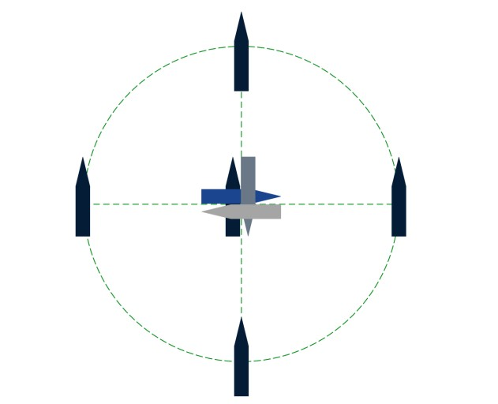
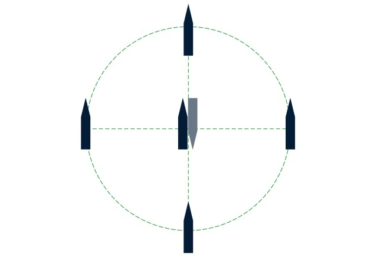

# :material-access-point: HiPAP USBL Calibration

:material-tag-outline: <strong>Calibration</strong>
:material-format-list-checks: <strong>Calibration Procedure</strong>
:material-calendar: <strong>2026-03-01</strong>

!!! abstract "Purpose"
    Perform an acoustic alignment of the HiPAP USBL transducer to the vessel's reference frame. The alignment determines the angular offsets between the heading/roll/pitch sensors and the HiPAP transducer, enabling the system to provide accurate subsea transponder positions at any water depth.

    After completion, the built-in transducer alignment function in APOS automatically calculates new installation parameters from the logged data. The function is found in Utility -> Transducer Alignment.

---

## :material-calendar-check: When to Use

- Every mobilisation where USBL is part of the survey spread
- After any change to USBL transducer mounting (removal, re-installation, pole swap)
- After any change to heading sensor, MRU, or GNSS antenna positions
- If verification (spin/transit) shows position errors exceeding acceptance criteria
- If vessel undergoes dry dock or structural modification near the transducer location

!!! tip "Weather Limits"
    Best results are achieved in sea state < 3 (significant wave height < 1.25 m). Higher sea states increase vessel motion noise in the data, degrading the calibration quality. If you must calibrate in rough weather, increase the number of position pairs per station to compensate.

---

## :material-tools: Equipment Required

| Equipment | Role |
|-----------|------|
| Kongsberg HiPAP USBL system with APOS software | Primary acoustic positioning system |
| Motion sensor (MRU/AHRS) | Attitude measurement |
| Heading sensor (gyrocompass) | Heading reference |
| GNSS receiver with correction data (dGNSS/RTK/PPP) | Surface positioning |
| Seabed transponder (180 deg beamwidth for shallow water, 30 deg for deep water) | Acoustic target |
| Sound velocity profiler | Water column velocity measurement |
| ROV, sandbags, or acoustic release for transponder deployment (if required for depth) | Transponder deployment |

---

!!! info "Prerequisites"
    - Dimensional control or lever arm verification completed for the transducer and GNSS antenna location, gyro heading, and roll/pitch values
    - If multiple gyro/motion sensors are interfaced, select the highest accuracy sensors for the alignment
    - If multiple GNSS systems are available, use the one with the highest accuracy
    - GNSS must use correction data (dGNSS/RTK/PPP)

---

## :material-list-status: Procedure

### Step 1: Select Alignment Area

The water depth is critical -- acoustic position errors must be dominant over GNSS errors.

- Optimum calibration depth is 400 to 1000 m
- A calibration at 200 m or deeper is valid for all operating depths
- A calibration shallower than 200 m is valid for operating depth up to two times the calibration depth
- Extreme sound velocity variations in the water column will reduce result quality
- Low signal-to-noise ratio (SNR) due to bad weather or high vessel thrust will reduce result quality

**Transponder distance from cardinal points:**

- 180 deg beamwidth transponder: 50-200% of water depth
- 30 deg beamwidth transponder: not more than 25% of water depth
- For vessels predominantly using USBL for towed surveys: 100-200% of water depth

**Error sensitivity by water depth:**

| Water Depth (m) | 0.2 m Error of WD (%) | Roll/Pitch Error for 0.2 m Horiz. Translation - Vessel Above (deg) | Yaw Error for 0.2 m Horiz. Translation - 50% WD Away (deg) | Yaw Error for 0.2 m Horiz. Translation - 100% WD Away (deg) |
|---|---|---|---|---|
| 50 | 0.40% | 0.23 | 0.46 | 0.23 |
| 100 | 0.20% | 0.11 | 0.23 | 0.11 |
| 200 | 0.10% | 0.06 | 0.11 | 0.06 |
| 500 | 0.04% | 0.02 | 0.05 | 0.02 |
| 1000 | 0.02% | 0.01 | 0.02 | 0.01 |
| 2000 | 0.01% | 0.01 | 0.01 | 0.01 |

### Step 2: Deploy Transponder

Deploy the seabed transponder using ROV, sandbags, or acoustic release as appropriate for the depth. Ensure the beacon is correctly positioned, anchored securely to the seabed, and has adequate battery charge.

### Step 3: Sound Velocity Profile

Load a current sound velocity profile into APOS for the alignment area. An upcast and a downcast profile shall be recorded and included in the calibration report.

### Step 4: Tide Setup (if applicable)

For areas with significant tidal change, enable tide correction in APOS:

| Step | Task |
|---|---|
| 1 | Open the Tide dialogue from the System menu |
| 2 | Select Measured from GNSS, select the primary GNSS/INS source |
| 3 | Enter the vertical distance from the position reference point to the zero-tide level (approximating the offset to waterline as zero-tide is acceptable) |
| 4 | Press Set -> Apply -> Close |

Tide data is automatically logged during transducer alignment if present. During calculation, you can choose to include or exclude tide compensation. The compensation uses the first non-excluded sample as a reference and adjusts all subsequent depth values by the tide difference.

### Step 5: Alignment Pattern (DP Vessels)

The recommended pattern is four cardinal points and four headings on top of the transponder. Select nominal vessel headings based on weather conditions to minimise vessel noise.

**Standard pattern:**

1. Record Centre location at Heading A
2. Navigate to each cardinal point and record at Heading A
3. Record Centre location at Heading A+90 deg
4. Record Centre location at Heading A+180 deg
5. Finish at Top location at Heading A+270 deg

**Simplified pattern** (if the vessel cannot maintain steady position at all four quadrant headings):

1. Record on the Top location
2. Adjust heading 180 degrees
3. Navigate to each cardinal point and record

<figure markdown="span">
  { width="400" }
  <figcaption>Standard alignment pattern: four cardinal points and four headings on top of the transponder.</figcaption>
</figure>

<figure markdown="span">
  { width="400" }
  <figcaption>Simplified alignment pattern: top position with 180-degree heading change, then cardinal points.</figcaption>
</figure>

### Step 6: Data Acquisition in APOS

| Step | Task |
|---|---|
| 1 | Add the deployed transponder to APOS |
| 2 | Navigate to the Top position |
| 3 | Open Transducer Alignment from Utility |
| 4 | Right-click and select New Alignment of APOS Transducer |
| 5 | Select the transducer to calibrate and the deployed beacon |
| 6 | Set the termination criteria to 300 position pairs |
| 7 | Press Start -- the system will interrogate the transponder and stop once 300 pairs are logged |
| 8 | Navigate and record 300 position pairs per the alignment pattern for each location and heading |
| 9 | Under Calculation parameters, ensure only Transducer Inclinations is ticked |
| 10 | Press View Measurements -- Numerically and Geographically |
| 11 | Press PDF Report |
| 12 | Repeat for the secondary transducer if present |

---

!!! note "Reporting"
    The alignment utility produces a report consisting of an HTML text file and four JPG images:

    - `[transceiver]TdAlignReport.htm`
    - `[transceiver]Results.jpg`
    - `[transceiver]TdAlignVessel.jpg`
    - `[transceiver]TdAlignMeasTpPos.jpg`
    - `[transceiver]TdAlignCompTpPos.jpg`

    Files are stored under `\APOS\Data\`.

    The report shall be complemented with:

    - Name of responsible surveyor for the calibration
    - Details of supporting systems (GNSS and INS/AHRS), including configuration screenshots and offsets for each system

    Save the completed report as PDF with the full HTML library for review and archiving.

---

!!! success "Quality Checks"
    - [x] Verify the calculated transducer inclination values are within expected range for the installation
    - [x] Review the graphical plots for consistent position solutions across all cardinal points
    - [x] Check that the standard deviation of the results is acceptable
    - [x] Confirm the SVP used was recorded in the calibration area on the day of calibration

---

## :material-check-decagram: Acceptance Criteria

| Parameter | Pass | Marginal | Fail |
|:--|:-:|:-:|:-:|
| SD of residuals (at operational depth) | < 0.5 m | 0.5-1.0 m | > 1.0 m |
| Heading misalignment | < 2.0 deg | 2.0-5.0 deg | > 5.0 deg |
| Pitch/Roll misalignment | < 2.0 deg | 2.0-5.0 deg | > 5.0 deg |
| Scale factor | 0.95-1.05 | 0.90-0.95 or 1.05-1.10 | < 0.90 or > 1.10 |
| Misalignment values consistent with installation | Expected | Unexpected but within range | Physically unreasonable |

!!! info "Depth-Dependent Accuracy"
    The SD of residuals scales approximately linearly with depth. A calibration at 500 m depth with SD = 1.0 m corresponds to approximately 0.2% of slant range, which is acceptable. Always assess SD as a percentage of depth, not as an absolute value alone.

---

## :material-wrench: Troubleshooting

### High SD in Calibration Results

**Possible causes**:

1. Weather too rough (excessive vessel motion adds noise). Wait for better conditions.
2. SVP inaccurate or not representative. Take a fresh SVP at the calibration site.
3. Transponder not stable on seabed (dragging, shifting). Verify with consistent depth readings.
4. Insufficient data -- need more position pairs per station.
5. Multipath in shallow water. Move to deeper water if possible.

### Large Heading Misalignment (> 5 deg)

**Possible causes**:

1. Wrong heading sensor selected in APOS (check sensor assignment)
2. Heading sensor offset entered incorrectly in DC survey
3. Transducer rotated from expected orientation during installation
4. If heading misalignment changes suddenly from previous calibration -- suspect transducer has been disturbed

### Scale Factor Outside 0.95-1.05

**Possible causes**:

1. SVP error (wrong or old SVP applied). Re-take SVP and reprocess.
2. Incorrect lever arm values in APOS (check DC survey offsets)
3. Transponder depth uncertain (depth error affects scale solution)
4. Timing error between GNSS and USBL systems

### Calibration Results Don't Match Between APOS and QINSy

**Action**: check the sign convention. APOS and QINSy use different sign conventions. When transferring results from QINSy to APOS, all signs must be inverted. See [USBL Calibration Data Processing](usbl-calibration-data-processing.md).

---

## :material-link-variant: Related Articles

- [HiPAP Verification (Spin & Transit)](hipap-hpr-verification.md)
- [USBL Calibration Data Processing](usbl-calibration-data-processing.md)
- [USBL Theory and Error Budgets](usbl-theory-and-error-budgets.md)
- [USBL Responder Latency Check](usbl-responder-latency-check.md)
- [AHRS Calibration](../mobilisation/ahrs-calibration.md)
- [Sound Velocity Operations](../sensors/sound-velocity-operations.md)
- [Dimensional Control Survey](../mobilisation/dimensional-control-survey.md)

---

!!! quote "References"
    - Kongsberg APOS Help files (Utility -> Transducer Alignment)
    - IMCA S 017 -- Guidelines for the use of USBL systems
    - IMCA S 015 -- Guidelines for Survey Mobilisation and Calibration
