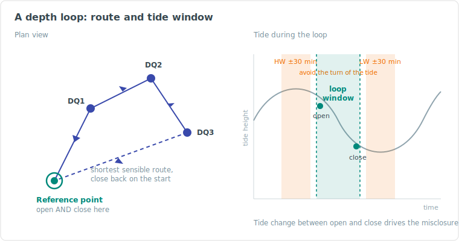

# :material-sync: Depth Loop Field Procedure

:material-tag-outline: <strong>Operations</strong>
:material-cog-outline: <strong>Field Procedure</strong>
:material-calendar: <strong>2026-07-07</strong>

!!! abstract "Purpose"
    How to plan, execute, and QC a pressure-sensor depth loop in the field -- the acquisition side: tide-window planning, station discipline, hold-stability criteria, live QC, and closing the loop with a defensible misclosure. The theory, sensor setup, and pressure-to-depth reduction maths are covered in [Depth Measurement Operations](depth-measurement-operations.md); this article is about actually running the loop.

---

## :material-information-outline: What You Are Trying to Achieve

A depth loop is a series of discrete pressure observations at subsea points of interest (spool ends, hub flanges, structure datums) that **starts and ends on the same reference point**. Because the loop closes on itself, the difference between the opening and closing observation -- the **misclosure** -- is a direct, self-contained quality figure for the whole loop.

Misclosure is dominated by the tide change between open and close, plus any sensor drift. The reduction distributes it linearly over time (see [closed loop reduction](depth-measurement-operations.md#closed-loops)). Everything in this procedure exists to keep the misclosure small and its cause explainable.

!!! tip "The one-line version"
    Warm sensor, fresh CTD, quiet tide window, short loop, still ROV, same point open and close.

---

## :material-calendar-clock: Planning

### Tide window

- Pull the predicted tide curve for the loop period before you start. The tide change during the loop goes straight into your misclosure, so **plan the loop across the flattest part of the curve** you can get.
- Do not observe within **~30 minutes either side of high or low water** -- the linear-over-time correction assumes a steady tide rate, and the turn of the tide breaks that assumption.
- Short loops beat long loops. Less elapsed time means less tide change, less drift, and a cleaner linear correction.

### Route and stations

- Plan the visiting order as the **shortest sensible route** between points, opening and closing on the same reference point.
- If the loop will run long, plan **re-visits to the reference point at intervals** (classically every ~30 minutes) or split the work into multiple smaller loops.
- Know each station's expected position and depth before diving. A station list in the survey package (or on paper) prevents "which flange was that" debates in reporting.

### Sensor and inputs

- Select a sensor whose **full-scale rating matches the working depth** -- accuracy scales with full scale, so a 4000 m-rated sensor in 500 m of water throws away accuracy for nothing.
- Pressure sensors need time to reach ambient water temperature: allow for **warm-up at working depth** (suppliers quote up to 2 hours for full stabilisation). Plan other checks -- USBL, INS, video -- during this window rather than waiting idle. A sensor still settling produces a slow drift that is indistinguishable from tide in the loop.
- Take a **CTD cast before the loop**, ideally to the deepest part of the work area, for the mean water-column density used in the conversion. Compare it against the previous cast.
- Decide the **atmospheric pressure handling** up front:
    - **Tare on deck** (zero against surface pressure) is fine for short dives -- but any atmospheric change after taring folds silently into your depths.
    - **A live barometer feed** to the survey package is preferred for longer work. Either way, log the barometric value and method.

---

## :material-checkbox-marked-circle-outline: On-Deck Checks

Before the vehicle dives:

- Calibration certificate valid, coefficients entered, and a copy in the project folder
- Output format, units and rate verified (continuous output at ~4 Hz is typical)
- Deck reading sensible: roughly atmospheric (about 13.8--15.2 PSI as pressure, or ~zero as depth if tared). A deck reading off by more than centimetre-level needs explaining **before** the dive -- wrong coefficients, blocked port, deposits, or a stale tare
- Offsets from the point of measurement to the sensor (brackets, handles) measured and recorded
- Data confirmed logging in the acquisition package, time-synced to the nav clock

---

## :material-target: At Each Station

The observation is only as good as the hold. At each point:

1. **Settle first.** The vehicle stable on or against the point, thrusters as quiet as the pilot can make them, and the pressure port out of thruster wash.
2. **Log a fixed window** -- 30 to 60 seconds at ~4 Hz is the common standard. Longer does not help; a clean 30 s beats a noisy 3 min.
3. **Watch the spread, not just the mean.** During the window, monitor:
    - **Pressure standard deviation** -- a sensor that is not sitting still shows it here first. A typical hold on a stable point gives a pressure SD equivalent to a few centimetres; if it is wandering, stop and re-settle.
    - **Position spread** -- confirms the vehicle actually held one spot rather than averaging a drift.
4. **Document the point.** Time, station ID, and log-file reference in the log; a video still or sketch of the exact point of measurement so the reported depth is unambiguous.
5. If a hold has to be accepted outside your stability criteria (weather, time pressure), **flag it as such** at acquisition time -- do not let it surface as a mystery in processing.

!!! warning "Re-log, don't average away"
    A bad hold does not improve by logging longer. If the SD is high or the vehicle moved, discard the window, note the reason, re-settle and re-log. Keep the discarded attempt in the record -- discards with reasons are part of an honest dataset.

---

## :material-restore: Loop Discipline

- **Open and close on the same physical point**, same sensor orientation, same offsets. "Near the same point" is not a closure.
- Revisit the reference point at planned intervals on long loops; each revisit gives an intermediate tide/drift check.
- Compute the **misclosure immediately at close-out**, before the vehicle leaves the site: raw (pressure) and tide-corrected. If it fails the acceptance criterion, the cheapest time to re-run the loop is right now, not after demob.
- For metrology-grade work, run the loop **at least twice**; repeatability between loops (commonly < 1.5 cm) is the acceptance check on top of each loop's own misclosure.
- Acceptance limits come from the **project-specific procedure** -- take them from there, never from memory.

---

## :material-chart-line: Reduction and Reporting

The reduction itself (linear time-distribution of misclosure, pressure-to-depth conversion, tide to datum) is covered in [Depth Measurement Operations](depth-measurement-operations.md#processing-and-reporting). From the field side, the report needs:

- Raw observations per station (the full logged windows, not just means)
- Per-station statistics: observation count, time window, mean and SD
- Open/close misclosure, raw and tide-corrected, and **which tide source was used**
- Whether reported depths are raw or reduced to datum -- stated explicitly
- Stills or sketches defining each point of measurement
- Sensor serial numbers, calibration certificates, offsets and the atmospheric-pressure method
- Discarded observations with reasons

!!! note "Tooling"
    Acquisition software can automate most of this -- live stability traffic-lighting, capture windows, running misclosure -- but the procedure is the same whether the tooling is a purpose-built dashboard or a stopwatch and a notebook. If the tool did the maths, the report still has to show the inputs.

---

## :material-alert-circle-outline: Common Pitfalls

| Pitfall | What it looks like | Avoid by |
|---------|-------------------|----------|
| Sensor not warmed up | Slow one-way drift through the loop, misclosure blames "tide" | Warm-up at depth before first station |
| Tared once, weather changed | Whole loop offset; misclosure may still look fine | Live barometer feed on long dives; log surface pressure at start and end |
| Stale or wrong CTD | Depths scale wrong; loops disagree with each other | Fresh cast, deepest point, compare to previous |
| Loop spans tide turn | Linear correction under/over-corrects mid-loop points | Plan around high/low water |
| Different open/close point | Misclosure meaningless | Same point, same orientation, photographed both times |
| Averaging through a bad hold | Station depth quietly wrong by the drift amount | Watch SD live, re-log bad windows |
| Ambiguous point of measurement | Deliverable depth can't be reproduced | Stills or sketch per station, offsets recorded |

---

## :material-book-open-variant: Related

- [Depth Measurement Operations](depth-measurement-operations.md) -- sensor types, accuracy, installation, pressure-to-depth conversion, loop reduction maths
- [Tidal Theory and Reduction Methods](../positioning/tidal-reduction-methods.md) -- tide sources and datum reduction
- [Sound Velocity Operations](sound-velocity-operations.md) -- CTD casts and water-column density
