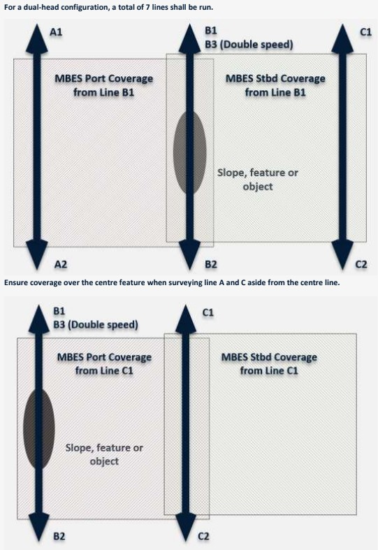

# :material-waves: MBES Calibration and Verification (Patch Test)

:material-tag-outline: <strong>Calibration</strong>
:material-format-list-checks: <strong>Calibration Procedure</strong>
:material-calendar: <strong>2026-03-01</strong>

!!! abstract "Purpose"
    Resolve residual angular misalignment between the multibeam transducer, motion sensor, and gyrocompass, plus any timing offset between the positioning system and the echosounder. A correctly executed patch test ensures that all beam footprints are placed at the correct geographic position and depth, enabling bathymetric surfaces that meet IHO S-44 and client specifications.

---

## :material-clipboard-check-outline: When to Use

Perform an MBES calibration (patch test) whenever any of the following apply:

- **Every mobilisation**, regardless of whether the system was previously calibrated on the same vessel
- After **transducer re-installation** or any change to its mounting (shims, brackets, bolts)
- After **motion sensor (MRU/IMU) replacement, re-mounting, or firmware update**
- After **gyrocompass replacement or re-alignment**
- After **significant vessel structural work** (dry dock, hull repairs, crane operations near sensor locations)
- After a **dimensional control survey** that produces new offset values
- When **client specification** requires a fresh calibration for the project
- If existing calibration values are **suspect** based on QC of survey data (e.g. systematic cross-line divergence)
- When changing from **vessel-mounted** to **ROV-mounted** MBES or vice versa

!!! warning "Do Not Skip the Patch Test"
    Applying calibration values from a previous mobilisation without verification is not acceptable. Even small mechanical changes (a loose bolt, thermal expansion, reseating a connector) can shift offsets enough to exceed tolerances.

---

## :material-information-outline: Overview

The patch test (also called a calibration test or multibeam alignment test) determines four residual offsets: position **latency**, **roll**, **pitch**, and **heading (yaw)**. Each offset is isolated by comparing overlapping bathymetric data acquired on specific line configurations over suitable terrain. The test is designed so that each offset produces a distinct, recognisable data signature. Offsets are resolved sequentially because some corrections affect the determination of subsequent offsets. After correction values are applied, the calibration data is reprocessed and verified to confirm that systematic errors have been removed.

---

## :material-book-open-variant: Theory / Principles

Each offset type produces a characteristic data signature. Understanding these signatures is essential for diagnosing problems, both during the calibration itself and later during production survey QC.

### Position Latency (Timing Offset)

**What it is:** A time delay between the moment a position fix is received and the moment the echosounder records a ping. If the position is applied late (or early), every sounding is displaced along the vessel's track by a distance proportional to speed.

**Data signature:** Two passes over the same feature in the **same direction at different speeds** will show the feature displaced along-track. The displacement is proportional to the speed difference. A feature that shifts forward at higher speed indicates positive latency (position arriving late).

**Formula:** Latency (seconds) = Along-track displacement / (Speed_fast - Speed_slow)

!!! info "Why Latency is Solved First"
    An uncorrected latency offset introduces along-track position errors that contaminate the pitch and heading solutions. Latency must be resolved before proceeding to angular offsets.

### Roll Offset

**What it is:** A residual angular misalignment of the transducer about the vessel's longitudinal (X) axis. This rotates the entire swath to port or starboard.

**Data signature:** Two **reciprocal lines** (opposite directions) over a **flat seabed** will show data that matches at nadir but diverges symmetrically with increasing beam angle. In cross-section, the two swaths form a characteristic **"butterfly" or "bowtie" pattern**. The divergence increases linearly with beam angle and is independent of water depth at nadir.

!!! tip "Roll vs Latency"
    Roll divergence is symmetrical about nadir in cross-section. If the pattern is asymmetrical or appears as a constant offset rather than a divergence, suspect a latency error, not roll.

### Pitch Offset

**What it is:** A residual angular misalignment of the transducer about the vessel's transverse (Y) axis. This tilts the swath forward or aft.

**Data signature:** Two **reciprocal lines** over a **slope** will show the bathymetric surface displaced along-track between the two passes. The displacement is proportional to altitude (distance from transducer to seabed). On a slope, this manifests as a depth offset at the same geographic position. Reversing direction reverses the sign of the displacement.

!!! info "Slope Requirement for Pitch"
    A flat seabed cannot resolve pitch because the effect is an along-track shift. Without a slope or distinct feature, there is no depth contrast to detect the shift. Use a slope of at least 5 degrees, ideally 10 to 20 degrees, running perpendicular to the line direction.

### Heading (Yaw) Offset

**What it is:** A residual angular misalignment between the gyrocompass heading reference and the transducer's fore-aft axis. This rotates the swath in the horizontal plane.

**Data signature:** Two **parallel lines** run in the **same direction** over a **feature or slope**, offset so the feature falls at different across-track positions in each swath. The feature will appear at different cross-track positions. The cross-track offset between the two observations of the feature reveals the heading error. The effect increases with off-track distance from nadir.

!!! tip "Feature Selection for Heading"
    The feature must be identifiable in the outer beams, not just at nadir. Pipelines, boulders, wrecks, or a distinct slope break all work well. If using a slope, run lines normal to the slope so that depth contours provide cross-track reference.

---

## :material-format-list-checks: Prerequisites

Before starting the calibration, ensure all of the following are complete:

| Prerequisite | Detail |
|:-------------|:-------|
| **Dimensional control** | Verified X, Y, Z offsets from a recent dimensional control survey entered into the acquisition software |
| **Sound velocity profile** | Current full water-column SVP taken at the calibration site, loaded into the acquisition system. For deep water, ensure the SVP extends to maximum survey depth |
| **Surface sound velocity** | Real-time SV sensor at transducer face operational and feeding the echosounder |
| **Motion sensor** | MRU/IMU powered on and settled (check manufacturer warm-up time). Verify that roll, pitch, and heave data are updating in the acquisition software |
| **Gyrocompass** | Settled and outputting heading. For fibre-optic gyros (FOG), allow minimum settling time per manufacturer specs (typically 20 to 45 minutes) |
| **Time synchronisation** | All systems synchronised to a common time reference (PPS + ZDA from GNSS). Verify PPS lock in the acquisition software |
| **MBES operational** | Echosounder pinging with stable bottom detection across the full swath. Verify frequency, pulse length, and power settings are appropriate for the water depth at the calibration site |
| **Acquisition software** | All sensor inputs configured and logging. Previous calibration values zeroed or set to nominal before starting (depending on software workflow) |
| **Area survey** | Calibration area identified and checked. No obstructions, anchored vessels, or traffic that will interfere with line runs |

!!! danger "Do Not Calibrate with a Stale SVP"
    A sound velocity profile that does not represent current water column conditions will introduce refraction artefacts (smile/frown pattern across the swath) that directly contaminate the roll solution. Take a fresh SVP immediately before calibration, or within the hour if conditions are stable.

---

## :material-list-status: Procedure

### Calibration Order

!!! warning "Order Matters"
    Solve offsets in this sequence: **Latency first, then Roll, then Pitch, then Heading**. Each solved offset must be applied before determining the next one, because uncorrected errors propagate into subsequent solutions.

### Step 1: Area Selection

Select calibration areas that meet the terrain requirements for each offset type:

| Offset | Terrain Requirement | Notes |
|:-------|:-------------------|:------|
| Latency | Well-defined feature on a slope | Pipeline, wreck, boulder, or distinct slope break. Feature must be clearly resolved at survey speed |
| Roll | Flat, featureless seabed | Slope less than 0.5 degrees. Uniform sediment. Avoid areas with ripples or strong backscatter variation |
| Pitch | Uniform slope, 5 to 20 degrees | Slope running perpendicular to the survey line direction. Avoid irregular terrain or scattered features |
| Heading | Distinct isolated feature or slope break | Feature must be resolvable in the outer beams. Alternatively, use a slope running parallel to the line direction so contours provide cross-track reference |

!!! tip "Combine Areas Where Possible"
    In practice, you may be able to run all calibration lines in one area if it has a flat section adjacent to a slope with a feature. This saves transit time and keeps environmental conditions consistent.

### Step 2: Line Planning

Plan calibration lines according to the following requirements:

**Latency (2 lines minimum):**

- Two passes over the same feature in the **same direction**
- One pass at **slow speed** (2 knots for vessel, 0.3 to 0.5 knots for ROV)
- One pass at **high speed** (4+ knots for vessel, 0.8 to 1.0 knots for ROV)
- The speed difference should be at least 50% of the faster speed to give a detectable displacement
- Feature must be crossed at or near nadir on both passes

**Roll (2 lines minimum):**

- Two passes over the **same line** in **opposite directions** (reciprocal headings)
- Same speed on both passes (2 to 4 knots for vessel, 0.3 to 0.5 knots for ROV)
- Over flat seabed
- Ensure **100% overlap** between the two swaths

**Pitch (2 lines minimum):**

- Two passes over the **same line** in **opposite directions** (reciprocal headings)
- Same speed on both passes
- Over a uniform slope (5 to 20 degrees)
- Ensure 100% overlap between the two swaths

**Heading (2 lines minimum):**

- Two passes in the **same direction**, on **parallel tracks**
- Offset the tracks so the target feature falls at different across-track distances (one pass with feature to port, one with feature to starboard, or one at nadir and one offset)
- Same speed on both passes
- Lines should overlap by at least 50% of the swath width

!!! info "Total Line Count"
    A standard single-head calibration requires a minimum of **8 lines** (2 latency + 2 roll + 2 pitch + 2 heading). In practice, some lines may serve double duty if terrain allows. Always run additional lines if results are ambiguous.

### Step 3: ROV-Specific Considerations

!!! tip "ROV Calibration"
    When calibrating MBES mounted on an ROV:

    - **Prefer shallow water** where ROV positioning accuracy is highest (shorter USBL/LBL ranges). If deep water is unavoidable, increase feature size to compensate for reduced positional accuracy.
    - **Run a reconnaissance line first** at high altitude to verify MBES coverage, confirm the feature is detectable, and check for obstacles at line turns.
    - **Maintain consistent altitude** throughout each line pair. Altitude changes introduce depth variations that can mask or mimic pitch errors.
    - **Minimise crab angle.** If current is pushing the ROV off-track, fly into the current. Excessive crab angle degrades the heading solution.
    - **Slow and steady wins.** ROV speed should be consistent and low enough for good bottom tracking. 0.3 to 0.5 knots is typical, never exceed 1.0 knot.
    - **Monitor DVL lock.** Loss of DVL bottom track during a calibration line invalidates that line. Watch for altitude spikes or dropouts.

### Step 4: Data Acquisition

1. **Zero or note existing calibration values** in the acquisition software before starting. Some workflows require zeroing; others apply values iteratively. Follow your software's recommended procedure.

2. **Take a fresh SVP** at the calibration site. Load it into the acquisition system and confirm it is being applied. If using an ROV-mounted SVP probe, perform a dip immediately before starting lines.

3. **Run latency lines first.** Acquire the slow-speed pass and then the fast-speed pass over the feature. Maintain straight, steady course through the feature. Avoid course corrections within the feature area.

4. **Process latency.** Calculate the latency offset in your processing software. Apply the correction to the acquisition software before proceeding.

5. **Run roll lines.** Acquire reciprocal passes over flat seabed. Maintain constant speed, heading, and altitude (ROV). Do not adjust echosounder settings between passes.

6. **Process roll.** Calculate the roll offset. Apply the correction.

7. **Run pitch lines.** Acquire reciprocal passes over the slope. Same speed, same altitude.

8. **Process pitch.** Calculate the pitch offset. Apply the correction.

9. **Run heading lines.** Acquire parallel same-direction passes over the feature with different off-track distances.

10. **Process heading.** Calculate the heading offset. Apply the correction.

11. **Reprocess all calibration data** with all four corrections applied simultaneously. Verify that systematic signatures have been eliminated.

12. **Run verification lines.** Acquire at least one pair of reciprocal cross-lines over the calibration area. Compare cross-sections and surfaces for residual systematic offsets. If divergence remains, iterate.

!!! warning "Do Not Skip Verification"
    Applying calculated values without reprocessing and verifying is a common shortcut that leads to problems in production. Always reprocess and confirm before moving to survey operations.

### Step 5: Dual-Head Configuration

For dual-head MBES systems (e.g. Kongsberg EM 2040 Dual, R2Sonic 2026 Dual):

1. **Run 7 lines total:**
    - Line A: Port offset line, direction 1
    - Line B: Centre line, direction 1
    - Line C: Starboard offset line, direction 1
    - Line D: Centre line, direction 2 (reciprocal of B)
    - Line E: Centre line, direction 1, slow speed (for latency)
    - Line F: Centre line, direction 1, fast speed (for latency)
    - Line G: Centre line, direction 2, slow speed (optional verification)

<figure markdown="span">
  { width="500" }
  <figcaption>Plan view of the 7-line dual-head MBES calibration pattern. Lines A and C are offset to port and starboard; line B runs over the centre feature. Ensure coverage over the centre feature from all lines.</figcaption>
</figure>

2. **Process each head independently.** Extract data for Head 1 and Head 2 separately. Solve roll, pitch, heading, and latency for each head.

3. **Check inter-head alignment.** After individual corrections are applied, verify that the two heads produce consistent depths in the overlap zone between the swaths. Residual depth differences in the overlap indicate inter-head roll or pitch misalignment. Some processing software (Qimera, CARIS) provides dedicated tools for inter-head alignment.

4. Ensure that offset lines A and C provide adequate coverage over the centre feature/slope so that all line combinations are usable for both heads.

!!! info "Dual-Head Overlap"
    The overlap zone between the two heads is the most sensitive area for detecting inter-head misalignment. Always inspect this zone in cross-section after applying corrections.

### Step 6: Apply and Document

1. Enter final calibration values into the acquisition software. Confirm values are applied and saved.

2. Record the following in the calibration report:

    - Date, time, and location of calibration
    - Equipment serial numbers and firmware versions
    - SVP cast used (time, location, and filename)
    - Pre-calibration offset values (what was entered before the test)
    - Calculated offset values for each parameter
    - Final applied values
    - Cross-sections and surface comparisons showing before and after correction
    - Pass/fail assessment against acceptance criteria

3. Save raw data, processed data, SVP files, and the calibration report. Archive per project requirements.

---

## :material-check-decagram: Acceptance Criteria

### Typical Values

| Parameter | Typical Range | Investigate If | Likely Mounting Problem If |
|:----------|:-------------|:---------------|:-------------------------|
| **Roll** | < 0.5 deg | > 1.0 deg | > 2.0 deg |
| **Pitch** | < 0.5 deg | > 1.0 deg | > 2.0 deg |
| **Heading (Yaw)** | < 0.5 deg | > 1.0 deg | > 2.0 deg |
| **Latency** | 0 to 50 ms | > 100 ms | > 500 ms |

!!! danger "Large Offsets Indicate a Physical Problem"
    Calibration offsets greater than 2.0 degrees for any angular parameter, or greater than 500 ms for latency, indicate a problem that should not be calibrated away. Investigate the physical installation, sensor mounting, cable connections, and time synchronisation before accepting such values.

### Post-Correction Verification

After applying corrections and reprocessing:

- **Roll:** No systematic divergence between reciprocal lines in cross-section. Outer beam depth differences between reciprocal lines should be less than the allowable TVU for the survey order.
- **Pitch:** No systematic along-track depth displacement between reciprocal lines on slopes. Depth differences at nadir on slope features should be within the allowable TVU.
- **Heading:** No systematic cross-track offset between parallel same-direction lines over features. Feature positions should agree to within the allowable THU.
- **Latency:** No systematic along-track displacement between different-speed lines. Feature positions should coincide regardless of vessel speed.

### IHO S-44 Edition 6.1.0 Context

IHO S-44 does not prescribe specific patch test acceptance criteria in degrees or milliseconds. Instead, S-44 defines allowable Total Vertical Uncertainty (TVU) and Total Horizontal Uncertainty (THU) for each survey order. The patch test must produce calibration values that, when applied, enable the survey system to meet the required TVU and THU at the 95% confidence level.

| Survey Order | Maximum THU (95%) | Maximum TVU (95%) |
|:-------------|:------------------|:------------------|
| Exclusive | 1 m | a = 0.15 m, b = 0.0075 |
| Special | 2 m | a = 0.25 m, b = 0.0075 |
| 1a | 5 m + 5% depth | a = 0.50 m, b = 0.013 |
| 1b | 5 m + 5% depth | a = 0.50 m, b = 0.013 |
| 2 | 20 m + 10% depth | a = 1.00 m, b = 0.023 |

TVU formula: +/- sqrt(a^2 + (b * d)^2) where d = depth in metres.

!!! note "Client Specifications May Be Tighter"
    Many offshore clients (particularly pipeline and construction support surveys) specify tighter tolerances than IHO S-44. Always check the project-specific scope of work for calibration acceptance criteria before starting.

### Repeatability

If time and conditions allow, run the patch test twice and compare results. Values should agree within 0.1 degrees for angular offsets and within 10 ms for latency. Poor repeatability indicates environmental interference (changing SVP, sea state, current) or a mechanical issue (loose mounting).

---

## :material-wrench: Troubleshooting

### SV Smile / Frown (Bad SVP)

**Symptom:** Swath cross-section shows a systematic curve, with outer beams bending up (frown) or down (smile) relative to the centre.

**Cause:** The loaded SVP does not match actual water column conditions. The sound velocity at the transducer face may also be incorrect.

**Fix:** Take a fresh SVP at the calibration site. Check that the real-time SV sensor at the transducer face is reading correctly and feeding the echosounder. Reprocess with the updated profile. Do not attempt to solve roll until the SV-induced curvature is removed.

!!! danger "SV Errors Contaminate Roll"
    A refraction artefact looks similar to a roll offset and will produce a false roll solution if not corrected first. Always verify the SVP before processing roll.

### Latency Mimicking Roll

**Symptom:** Cross-sections from reciprocal lines show what appears to be a roll offset, but the pattern is asymmetrical or inconsistent between line pairs.

**Cause:** Uncorrected latency combined with vessel pitch or heave motion can produce cross-track depth differences that resemble a roll error.

**Fix:** Ensure latency is solved and applied first. If the "roll" signature changes significantly after applying latency, the original observation was contaminated by timing errors.

### Large Offsets Changing Between Calibrations

**Symptom:** Calibration values differ by more than 0.3 degrees from the previous calibration on the same installation.

**Cause:** Loose transducer mounting, loose MRU mounting, shifted bracket, or thermal expansion/contraction of the mounting structure.

**Fix:** Physically inspect all mounting bolts and brackets. Check torque values against manufacturer specifications. Look for signs of movement (paint cracks, witness marks shifted, corrosion at bolt interfaces). Repeat the dimensional control survey if the issue cannot be identified visually.

### Wrong Sign Convention

**Symptom:** Applying the calculated correction makes the divergence worse instead of better.

**Cause:** The sign convention for roll, pitch, or heading in the processing software does not match the acquisition software, or the sensor output convention differs from what the software expects.

**Fix:** Check the coordinate convention documentation for both the acquisition and processing software. Verify the MRU and gyro output conventions. Some systems define positive roll as port-up, others as starboard-up. If in doubt, apply a known small offset (e.g. +0.50 deg roll) and check which direction the outer beams move in the processed data.

### Heave Artefacts

**Symptom:** Reciprocal lines show oscillating depth differences rather than a smooth, systematic offset. The pattern correlates with sea state or vessel motion period.

**Cause:** Incorrect heave input (wrong sensor, wrong lever arm, wrong filter settings), or the heave sensor is not properly settled.

**Fix:** Verify the heave source in the acquisition software. Check that the MRU lever arm (distance from MRU to transducer) is correctly entered. Ensure the MRU has completed its settling period. If heave data is noisy, consider waiting for calmer conditions or using delayed heave (post-processed heave) for the calibration.

### Dual-Head Inter-Alignment Issues

**Symptom:** Each head passes individual calibration, but there is a systematic depth step or divergence in the overlap zone between the two heads.

**Cause:** The two heads have slightly different mounting angles that are not fully resolved by independent calibrations. This is common when the heads are mounted on separate brackets.

**Fix:** Use the inter-head alignment tool in your processing software (Qimera, CARIS HIPS). This resolves a residual roll offset between the two heads. If the step is large (> 0.1 m), check the physical mounting of both heads and the dimensional control offsets.

### Calibration Area Too Small or Featureless

**Symptom:** Processing software cannot converge on a solution, or the solution has very large uncertainty.

**Cause:** Insufficient terrain contrast for the offset being solved. Flat seabed cannot resolve pitch. Featureless seabed cannot resolve heading. Short line runs do not provide enough data for statistical convergence.

**Fix:** Relocate to an area with suitable terrain. Extend line lengths to at least 10 swath widths. For heading, ensure the feature is visible in both inner and outer beams on both parallel lines.

---

## :material-link-variant: Related Articles

- [MBES Installation and Setup](mbes-installation-and-setup.md) - Transducer mounting, offset entry, time synchronisation
- [MBES Operations and Settings](mbes-operations-and-settings.md) - Frequency, pulse length, power, and coverage settings
- [Heave / MRU Theory](../mobilisation/heave-mru-theory.md) - Motion sensor principles, heave filtering, lever arm effects
- [Sound Velocity Operations](sound-velocity-operations.md) - SVP deployment, calibration, and application
- [Dimensional Control Survey](../mobilisation/dimensional-control-survey.md) - Measuring and computing sensor offsets

---

## :material-table: Quick Reference

### Offset Summary Table

| Offset | Lines Required | Direction | Speed | Terrain | Typical Value | Pass | Fail |
|:-------|:--------------|:----------|:------|:--------|:-------------|:-----|:-----|
| **Latency** | 2 (same direction) | Same heading | Different (slow + fast) | Feature on slope | 0 to 50 ms | < 100 ms | > 500 ms |
| **Roll** | 2 (reciprocal) | Opposite headings | Same | Flat (< 0.5 deg) | < 0.5 deg | < 1.0 deg | > 2.0 deg |
| **Pitch** | 2 (reciprocal) | Opposite headings | Same | Slope (5 to 20 deg) | < 0.5 deg | < 1.0 deg | > 2.0 deg |
| **Heading** | 2 (parallel, same dir) | Same heading | Same | Feature / slope | < 0.5 deg | < 1.0 deg | > 2.0 deg |

### Calibration Checklist

- [ ] Fresh SVP taken at calibration site and loaded
- [ ] Real-time SV sensor operational at transducer face
- [ ] Dimensional control offsets verified in acquisition software
- [ ] Time synchronisation confirmed (PPS lock)
- [ ] MRU settled and outputting valid attitude data
- [ ] Gyro settled and outputting valid heading
- [ ] Calibration area identified with suitable terrain
- [ ] Latency solved and applied **before** angular offsets
- [ ] Roll solved and applied
- [ ] Pitch solved and applied
- [ ] Heading solved and applied
- [ ] All data reprocessed with final values
- [ ] Verification lines acquired and checked
- [ ] Calibration report completed and filed

### Data Signature Quick-ID

| Observation in Data | Likely Cause | Check |
|:-------------------|:-------------|:------|
| Outer beams curve up/down (smile/frown) | Bad SVP or surface SV | Take fresh SVP, check SV sensor |
| Reciprocal lines diverge symmetrically from nadir | Roll offset | Process roll calibration lines |
| Reciprocal lines offset along-track on slope | Pitch offset | Process pitch calibration lines |
| Feature at different cross-track positions on parallel lines | Heading offset | Process heading calibration lines |
| Feature shifts along-track at different speeds | Latency offset | Process latency calibration lines |
| Oscillating depth differences correlated with sea state | Heave problem | Check MRU lever arm, settling, filter |
| Depth step in dual-head overlap zone | Inter-head misalignment | Run inter-head alignment tool |

!!! quote "References"
    - IHO S-44 Edition 6.1.0, Standards for Hydrographic Surveys
    - IHO C-13, Manual on Hydrography (Chapter 3: Depth Determination)
    - Kongsberg Maritime, EM Series Installation Manual, Multibeam Calibration Procedure
    - QPS Qinsy / Qimera Documentation, Patch Test Calibration Workflow
    - R2Sonic, "The New Patch Test" Technical Paper
