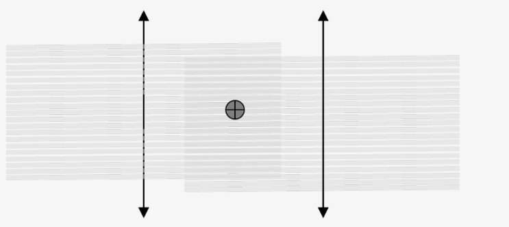

# :material-sine-wave: Side Scan Sonar Positioning and Quality Verification

:material-tag-outline: <strong>Equipment</strong>
:material-format-list-checks: <strong>Verification</strong>
:material-calendar: <strong>2026-03-01</strong>

!!! abstract "Purpose"
    Verify that side scan sonar (SSS) positioning is within project specification and that visual data quality meets requirements. SSS-derived contact positions are compared against MBES reference positions.

---

## :material-tools: Equipment Required

| Equipment | Role |
|-----------|------|
| Side scan sonar system (HF and LF) | Primary sensor |
| ROV, ROTV, or towed platform | Deployment vehicle |
| MBES | Reference data |
| SonarWiz | Processing software |
| INS and/or USBL positioning system | Position source |
| Navigation/acquisition software | Data acquisition |

---

!!! info "Prerequisites"
    - MBES data available for the SSS verification test area
    - USBL calibrated deeper than the maximum survey depth (if not, inform the offshore coordinator)
    - Well-defined contact identified in MBES data

---

## :material-clipboard-check-outline: Setup Checklist

Before the verification test, check the following to avoid constant and systematic errors:

| # | Item | Check |
|:-:|------|-------|
| 1 | **Offsets and position source** | Verify SSS transducer offsets from dimensional control are correctly entered in acquisition software |
| 2 | **INS** | Check if an INS is present in the same vehicle as SSS; if not, send only USBL position |
| 3 | **Heading source** | Check heading source and correct setup |
| 4 | **Time sync** | Verify time sync is configured correctly and working |
| 5 | **Mounting of transducers** | Visual inspection on deck to confirm SSS transducers are correctly mounted, parallel, and match dimensional control |
| 6 | **USBL calibration depth** | State the calibration depth; should be deeper than max survey depth |
| 7 | **Time port** | Verify only `$GPZDA` is sent to the time port |
| 8 | **Declination** | Add declination if fluxgate is used as heading source |
| 9 | **Range** | Ensure correct range for the survey is set |
| 10 | **KP** | Ensure KP is enabled |
| 11 | **Test file** | Run a test file while SSS is on deck; offshore coordinator/geologist verifies correct content |

!!! warning "Sign-off"
    The correct setup shall be confirmed by the offshore coordinator/geologist.

---

## :material-list-status: Procedure

### Step 1: Confirm Reference Data

Make sure MBES data is available for the SSS verification test area prior to launching the vehicle.

### Step 2: Select Target

Choose a well-defined contact in the MBES data (e.g., boulder or easily distinguishable feature).

!!! tip "Target Selection Criteria"
    The verification target should meet **all** of the following:

    - Minimum **0.5 m relief** above the surrounding seabed
    - **Isolated** -- no nearby features that could cause ambiguity
    - Clearly **identifiable on MBES data** so positions can be compared unambiguously

!!! warning "Fluxgate Heading"
    Avoid metallic wrecks if using a fluxgate as heading source since these can negatively affect positioning.

### Step 3: Pre-Dive Check

Perform a pre-dive check before launching the vehicle.

### Step 4: Run Lines

Run two lines, each back and forth in opposite directions (four runs total):

- Lines centred on the contact
- Contact location at approximately 2/3 of effective range or selected range (whichever is shorter)
- Run line length approximately 400 m (200 m each side of the contact); may be reduced at low survey speeds
- Constant speed (planned survey speed)
- Stable altitude (planned survey altitude)
- Constant run line direction, selected to minimise pitch movement

<figure markdown="span">
  { width="500" }
  <figcaption>SSS verification run line pattern: two lines run back and forth in opposite directions, centred on the reference contact.</figcaption>
</figure>

### Step 5: Process in SonarWiz

- Use an SV value at the **transducer depth** (not the average water column SV -- the acoustic pulse travels laterally at transducer depth, so the SV at that depth is what governs slant-to-ground range conversion)
- Apply vessel file
- Apply pitch correction
- Verify correct file format, position source, and heading source

!!! info "Ground Range vs Slant Range"
    SSS data is acquired in **slant range** (the direct distance from the transducer to a target). Processing software converts slant range to **ground range** (the horizontal distance along the seabed). This conversion requires accurate altitude and SV. If slant-to-ground-range correction is wrong, contacts at far range will show the largest position errors. Always verify that the flat-bottom correction is applied correctly in SonarWiz.

### Step 6: Compare Positions

Compare SSS contact positions with MBES-derived positions. Check that contact positions fall within project specifications (acceptance criteria from the ITP).

### Step 7: Data Quality Review

The Marine Geologist confirms data quality and positioning.

---

!!! note "Reporting"
    Comparison results shall be presented in tabular form in the MAC report. Both HF and LF results shall be presented when ranges differ.

---

!!! success "Quality Checks"
    - [x] SSS contact positions within project specification tolerances compared to MBES reference
    - [x] No significant positioning artefacts between reciprocal runs
    - [x] Vehicle movement smooth and within survey parameters during test
    - [x] Setup checklist completed and confirmed by offshore coordinator/geologist

---

## :material-calendar-check: When to Use

Perform SSS positioning verification:

- At the **start of every project** before production SSS surveys begin
- After any change to the SSS system, mounting, or vehicle configuration
- After any change to the positioning system (USBL recalibration, INS swap, heading source change)
- When moving to a significantly different water depth (re-verify USBL performance)
- When switching between HF and LF channels if different transducers are used

---

## :material-check-decagram: Acceptance Criteria

| Parameter | Criterion |
|-----------|-----------|
| SSS contact position vs MBES reference | Within **project specification** (typically 2-5 m depending on range and water depth) |
| Reciprocal run scatter | Contact positions from opposite runs within **2 m** of each other (for short-range surveys) |
| Along-track consistency | No systematic offset between forward and reverse runs exceeding **1 m** |
| Cross-track consistency | No systematic offset between port and starboard contacts exceeding specification |

!!! note
    Acceptance criteria are project-specific. Always check the ITP for the applicable tolerances. The values above are typical guidelines.

---

## :material-wrench: Troubleshooting

If position verification fails to meet expected values:

1. **Heading source (most common error):** Incorrect heading source is the single most frequent cause of SSS position errors. Verify which heading is actually being applied -- ROV gyro, fluxgate, USBL-derived, or INS heading. A wrong heading source rotates all contacts around the vehicle position, producing large cross-track errors that increase with range.
2. Check if vehicle movement was smooth and within survey parameters; if not, repeat the test
3. If movement was acceptable, check possible sources of error:
    - Offsets entered incorrectly or in wrong sign convention
    - Layback not applied or applied incorrectly
    - Time synchronisation drift between SSS and positioning system
4. If setup is correct (offsets, heading and position sources), run separate patch tests to check:
    - USBL angular offset
    - Latency
    - Pitch bias
    - Heading bias

---

## :material-link-variant: Related Articles

- [Pipeline Survey Operations](../rov/pipeline-survey-operations.md)
- [Pipe Tracker (HydroPACT 440/660) Verification](pipetracker-hydropact-verification.md)
