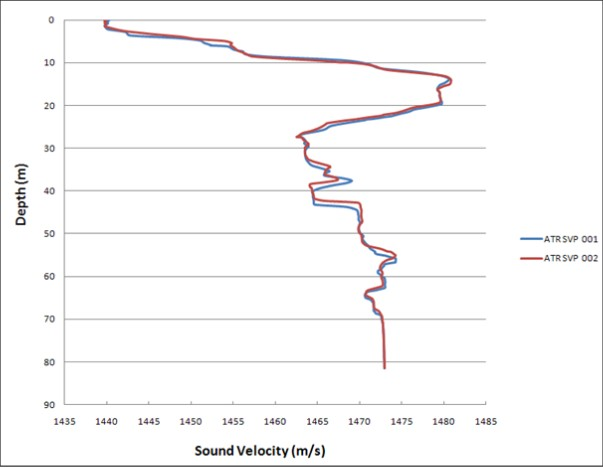

# :material-thermometer-water: Sound Velocity Operations

<div class="page-meta" markdown>
<span class="meta-item">:material-tag-outline: <strong>Calibration</strong></span>
<span class="meta-item">:material-cog-outline: <strong>Operations Guide</strong></span>
<span class="meta-item">:material-calendar: <strong>2026-03-01</strong></span>
</div>

!!! abstract "Purpose"
    Detail the requirements for calibration, installation, deployment, and processing of sound velocity measurement equipment so that accurate sound velocity profiles are produced for use in acoustic survey operations including MBES, USBL, LBL, and SBES systems.

---

## :material-calendar-check: When to Use

- **Full-column SVP/CTD cast**: Before USBL calibration, at project start, before/after LBL baselines, after significant depth/location/weather change, and at intervals defined by the scope of work
- **Real-time SVS monitoring**: Continuously during all acoustic operations (MBES, USBL, SBES) to detect water column changes between full casts
- **Expendable probes (XBT/XCTD)**: In deep water (> 1500 m) where winch-deployed casts are impractical or too time-consuming, or when vessel operations cannot be interrupted for a full cast

---

## :material-information-outline: SVP vs CTD Measurement Methods

The speed of sound converts acoustic travel time to distance across all acoustic systems (LBL, USBL, MBES, SBES/altimeters).

| Method | Measurement Principle | Outputs |
|--------|----------------------|---------|
| **SVP (Sound Velocity Profiler)** | Digital time-of-flight measurement | Direct sound velocity |
| **CTD (Conductivity, Temperature, Depth)** | Measures conductivity, pressure, and temperature; sound velocity is calculated from these using formulae | Sound velocity, salinity, density, depth |

**Advantage of CTD**: density (a function of salinity, temperature, depth, and local gravity) can be calculated for pressure-to-depth conversion.

Both CTD and SVP systems may be:

- **Direct reading** -- data outputs in real time on a display
- **Self-recording** -- data is recorded internally during deployment and downloaded later. Can be pre-programmed with SV formulae, recording intervals, and trigger source for faster deployment/recovery.

---

## :material-target: Equipment Accuracy Comparison

| Manufacturer | Model | Sound Velocity | Conductivity | Pressure | Temperature |
|-------------|-------|---------------|--------------|----------|-------------|
| Valeport | SVX2 | +/-0.03 m/s | +/-0.01 mS/cm | +/-0.01% range | +/-0.01 degC |
| Valeport | Midas SVP | +/-0.02 m/s | N/A | +/-0.01% range | +/-0.01 degC |
| Valeport | Midas CTD | N/A | +/-0.01 mS/cm | +/-0.01% range | +/-0.01 degC |
| Valeport | miniSVS 100 mm | +/-0.017 m/s | N/A | Optional +/-0.05% range | Optional +/-0.01 degC |
| Valeport | miniSVS 50 mm | +/-0.019 m/s | N/A | Optional +/-0.05% range | Optional +/-0.01 degC |
| Valeport | miniSVS 25 mm | +/-0.02 m/s | N/A | Optional +/-0.05% range | Optional +/-0.01 degC |
| Seabird | SBE25 | N/A | +/-0.0003 S/m | +/-0.1% range | +/-0.002 degC |
| Seabird | SBE19plus | N/A | +/-0.0005 S/m | +/-0.1% range (strain gauge) or +/-0.02% range (quartz) | +/-0.005 degC |
| Seabird | SBE9plus | N/A | +/-0.0003 S/m | +/-0.015% range | +/-0.001 degC |
| SAIV | SD204 | Calc 0.05 m/s | 0.02 mS/cm | 0.01% FS | 0.01 degC |

!!! note "miniSVS variants"
    Optional pressure or temperature sensor may be fitted, but not both simultaneously.

---

## :material-alert-circle-outline: Why Sound Velocity Matters

Every acoustic measurement in the water column -- MBES depths, USBL ranges, LBL baselines -- depends on knowing the speed of sound. Get the sound velocity wrong and every distance derived from acoustic travel time is wrong by the same proportion.

### The Physics

Sound travels through seawater at approximately 1,500 m/s, but the actual value varies from roughly 1,450 to 1,570 m/s depending on three factors:

| Factor | Sensitivity | Dominant Where |
|--------|------------|----------------|
| **Temperature** | ~4.6 m/s per 1 degC increase | Upper water column (0-1000 m), where temperature gradients are strongest |
| **Salinity** | ~1.3 m/s per 1 PSU increase | Coastal waters, estuaries, river plumes, enclosed seas |
| **Pressure (depth)** | ~1.7 m/s per 100 m depth increase | Deep water (below the thermocline), where temperature is stable and pressure dominates |

Temperature is the dominant variable in most survey situations. A 5 degC change in water temperature shifts sound velocity by approximately 23 m/s -- enough to cause measurable errors in both depth and range calculations.

### How MBES Uses Sound Velocity

Multibeam echosounders use sound velocity in two distinct ways:

1. **Beam steering at the transducer face.** The surface sound velocity (from a hull-mounted SVS) determines how the transmitted fan of beams is formed and how received echoes are assigned to beam angles. An incorrect surface SV distorts the beam geometry, producing roll-like artifacts across the swath (Type III error).

2. **Ray-tracing through the water column.** The full-column SVP is used to compute the curved path each beam follows from the transducer to the seabed. Snell's Law governs the refraction at each layer boundary. An incorrect SVP means the ray-tracing places the sounding at the wrong depth and the wrong horizontal position.

### The Smiles and Frowns

The classic diagnostic for SVP errors in MBES data is the shape of the across-track depth profile when surveying a flat seabed:

| SVP Error | What Happens | Swath Shape |
|-----------|-------------|-------------|
| SVP too fast (velocities higher than reality) | Ray-tracing under-refracts the outer beams, placing them too deep at the edges | **Frown** -- edges curve downward relative to nadir |
| SVP too slow (velocities lower than reality) | Ray-tracing over-refracts the outer beams, placing them too shallow at the edges | **Smile** -- edges curve upward relative to nadir |
| SVP outdated (thermocline has shifted) | Asymmetric refraction errors | Lopsided distortion or "wobble" in the outer swath |

These artifacts are most visible in the outer beams (beyond 45 deg) because those beams travel at steep angles through the water column and accumulate more refraction error. Nadir beams travel nearly vertically and are largely unaffected.

!!! tip "Overlap Check"
    The fastest way to spot SVP errors is to compare overlapping swaths from adjacent survey lines. If the outer beams of one line disagree with the nadir of the overlapping line, the SVP needs updating. This disagreement will show the smile/frown pattern.

### Quantifying the Error: The 0.25% Threshold

Research published through the International Hydrographic Review established a depth bias threshold of **0.25% of water depth** as the point at which SVP-induced errors become incompatible with MBES uncertainty budgets and risk failing IHO S-44 requirements.

In practical terms:

| Water Depth | 0.25% Threshold | What This Means |
|-------------|-----------------|-----------------|
| 20 m | 0.05 m | Very tight -- SVP must be accurate and current |
| 50 m | 0.125 m | Manageable with regular casts |
| 200 m | 0.50 m | More forgiving, but outer beams still sensitive |
| 1000 m | 2.50 m | Absolute threshold is larger, but errors at outer beams can still exceed this |

Errors above 0.25% of water depth indicate the SVP is not representative of the actual water column. The fix is a fresh SVP cast. In variable coastal waters, this may mean multiple casts per day. Spatiotemporal interpolation of SVP data (using casts from different times and locations) has been shown to reduce depth bias by a factor of three compared to using a single static profile.

### Related Reading

- [Underwater Acoustics Fundamentals](../reference/underwater-acoustics.md) -- the physics of sound propagation, absorption, and refraction that underpin all acoustic survey operations

---

## :material-certificate-outline: Calibration Validity Periods

Sound velocity sensors require calibration by the manufacturer or a certified test laboratory against a traceable standard.

| Sensor Type | Calibration Validity |
|-------------|---------------------|
| SV probes (SVP) | 2 years |
| CTD probes | 1 year |
| Combined CTD/SVP probes | 2 years, provided CTD-derived and directly measured SV agree within instrument and formula accuracy for the water type/depth |

!!! info "Maintaining Validity"
    - Instruments must be maintained per manufacturer's instructions
    - Regularly test against other calibrated units as confirmation
    - If a calibration certificate may expire during a project, arrange a replacement before the expiry date
    - If operational replacement is not feasible, the client may agree to continue use if the instrument tests successfully against a certified sensor

!!! warning "Client-Specific Calibration Requirements"
    Some clients mandate a **1-year calibration validity for all sound velocity sensors** regardless of sensor type, overriding the manufacturer's 2-year validity for SVP probes. Always check the project-specific calibration requirements before mobilisation and ensure all certificates will remain valid for the planned project duration.

---

## :material-arrow-down-bold-circle-outline: Deployment Procedures

### Manual Deployment

| Step | Action |
|------|--------|
| 1 | Attach a safety line / deck lead to the probe -- do not deploy using only the data cable |
| 2 | Confirm the water depth at the deployment location |
| 3 | Obtain permission from the bridge before over-boarding |
| 4 | Over-board the probe and hold near the surface for **10 minutes** while the instrument acquires ambient water temperature. Record barometric pressure in the logbook |
| 5 | Lower the probe steadily to the seabed, then recover |
| 6 | On recovery, check sensors for fouling. If fouled, repeat the measurement. If fouling cannot be avoided, use only the down cast |
| 7 | Rinse the instrument with fresh water on recovery |
| 8 | Inform the bridge when the operation is complete |

!!! tip "Cable Management"
    Unless on a reel, lay the cable out in a figure-of-eight pattern before deployment.

### Downline Deployment

- Connect the probe above any clump weight or headache ball
- If direct reading, secure the communications cable to the downline at ~5 m intervals to prevent wrapping
- Follow the same 10-minute surface soak, steady lowering, fouling check, and fresh-water rinse procedures as manual deployment

### ROV Deployment

- Function-check and set up the instrument before launch; enable logging and record barometric pressure
- After launch, hold the ROV near the surface while the instrument acquires ambient temperature; monitor until temperature stabilises before continuing descent
- Once the TMS is at depth, the ROV exits the TMS to reach the seabed. Alternatively, with ROV supervisor permission, the TMS can be lowered to the seabed while the ROV remains inside (monitor via ROV altimeter)

!!! info "TMS Depth Gap"
    Installing the SVP/CTD on the ROV TMS is a second choice to installation on the vehicle itself and should only be considered when insufficient cores are available on the ROV. The gap between TMS depth and ROV operating depth must be accounted for.

- Unless the dive is specifically for obtaining an SVP, logging may be paused during operations but continuous SV monitoring by the online surveyor is recommended
- Re-enable logging before recovery to obtain an up cast
- Rinse the instrument with fresh water once on deck

---

## :material-clock-outline: Measurement Frequency Requirements

| Occasion | Requirement |
|----------|-------------|
| Prior to USBL calibration or integrity check | Required |
| Start of a new project | Required |
| Before and after LBL baseline / box-in measurements | Required (cast need only cover transponder depth range) |
| During LBL operations | Generally daily; may extend to weekly if water column is known to be stable |
| During USBL operations | Generally weekly; may extend to monthly if water column is known to be stable |
| During MBES operations | Generally daily; depends on operational conditions |
| Prior to position-critical operations (e.g. structure installation) | Required |
| Significant depth change (>200 m) | Required |
| Significant location change | Required |
| Weather change (e.g. storm mixing top layers, altering/removing thermocline) | Required |
| Thermocline shift (e.g. prolonged warm stable weather lowering thermocline) | Required |

### Factors Affecting SV Measurement Timing

Consider the following when deciding whether to take a new cast:

- Task being carried out
- Date and location of the previous cast
- Change in depth
- Proximity to river mouths or currents
- Significant tidal changes
- Recent weather events

---

## :material-function-variant: Sound Velocity Formulae

### Formula Selection

| Depth Range | Recommended Formula |
|-------------|-------------------|
| Less than 1000 m | Chen & Millero (1977) or Del Grosso (1974) |
| Greater than 1000 m | Del Grosso (1974) |

**Chen & Millero** -- C.T. Chen and F.J. Millero (1977), "Speed of sound in seawater at high pressures", Journal of the Acoustic Society of America 62(5):1129-1135

**Del Grosso** -- V.A. Del Grosso (1974), "New Equation for the Speed of Sound in Natural Waters (with Comparisons to Other Equations)", J. Acoust. Soc. Am., 56(4), pp 1084-1091

### Setup Recommendations

- Synchronise instrument time with project time
- Record **pressure** (not depth) -- depth is calculated during processing
- Use SI units (metres, dbar, mS/cm); convert to imperial only after processing if required by the client
- Set the pressure tare before deploying the instrument or launching the ROV; record the tare value in the logbook
- Enter the correct latitude for the local gravity model (if available)
- Record atmospheric pressure in the logbook
- If self-logging, set the probe to record on pressure changes of 1 dbar
- Enable recording for both up and down casts

---

## :material-earth: Special Cases: Lakes, Caspian Sea, and Closed Water Bodies

### Lakes (Baikal, Tanganyika, Malawi)

These lakes have a salt composition effectively proportional to Standard Seawater diluted to the same salinity. The standard equations for salinity, density, and sound velocity are valid.

### Caspian Sea

The Caspian Sea has a different composition of salts, causing erroneous calculated values.

**Correction method:**

1. Determine salinity using the standard equation
2. **Add 1.4 ppt** to the salinity value
3. Calculate density and sound velocity using the standard equations with the adjusted salinity

### Unknown Closed Water Bodies

For bodies of water with no documented evidence of salt composition, sound velocity must be determined by SVP. Simultaneous CTD measurements should also be taken to form profile pairs.

**Least-squares comparison method:**

1. Obtain as many combined CTD/SVP profile pairs as feasible (minimum 5, preferably 20) scattered across the area of interest
2. For each profile pair:
    - Calculate salinity using the standard equations
    - Incrementally add or subtract 0.1 ppt to the calculated salinity
    - Recalculate sound velocity using the adjusted salinity
    - Determine residuals between measured (SVP) and calculated (CTD-derived) sound velocity at each depth
    - Calculate the sum of squared residuals
    - Continue for at least 5 increments past the point where the sum of squares is minimised
    - The correction for that profile pair is the increment/decrement at the minimum sum of squares
3. Use the mean correction across all profile pairs to adjust calculated salinity for density calculations

---

## :material-thermometer-lines: Thermocline Effects on Acoustic Systems

A thermocline is a layer of rapid temperature change that causes a corresponding change in sound velocity. This gradient refracts acoustic energy, bending the ray path away from the straight-line assumption.

### Impact on MBES Outer Beams

Multibeam echosounders are particularly sensitive to sound velocity errors because outer beams travel at steep angles through the water column and are refracted more than nadir beams.

| Condition | Effect on Outer Beams |
|-----------|----------------------|
| SVP too high (warm bias) | Beams refract upward -- outer swath depths appear **too deep** ("frown" shape) |
| SVP too low (cold bias) | Beams refract downward -- outer swath depths appear **too shallow** ("smile" shape) |
| Outdated SVP (thermocline has shifted) | Asymmetric distortion or "wobble" in the outer swath |

!!! tip "Practical Check"
    Compare overlapping swaths from adjacent survey lines. If the outer beams of one line disagree with the nadir of the overlapping line by more than the required specification, a fresh SVP is needed.

### Impact on USBL and LBL

For USBL and LBL, an incorrect sound velocity profile causes **range errors** (the slant range calculated from two-way travel time is wrong) and **angular refraction errors** (the assumed straight-line path deviates from the actual refracted path). These effects worsen with depth and horizontal offset.

---

## :material-test-tube: Expendable Probes (XBT / XCTD)

In deep water where winch-deployed SVP/CTD casts are impractical or would require stopping vessel operations, expendable probes provide a practical alternative.

| Probe | Measures | Typical Use |
|-------|----------|-------------|
| **XBT (Expendable Bathythermograph)** | Temperature vs depth (fall-rate equation) | Quick temperature profile; SV must be calculated using assumed salinity |
| **XCTD (Expendable CTD)** | Conductivity, temperature, depth | Full SV calculation possible; more accurate than XBT |

!!! info "Limitations"
    - Expendable probes are **single-use** -- factor consumable cost and stock into project planning
    - XBT accuracy depends on the fall-rate equation, which can drift for older probe batches -- check the manufacturer's current coefficients
    - XBT-derived SV requires an assumed salinity value, which introduces error in regions with variable salinity
    - XCTD is preferred over XBT when sound velocity accuracy is critical
    - Maximum depth rating varies by probe type (commonly 1000 m or 2000 m for XBT; up to 2000 m for XCTD)

---

## :material-chart-line-variant: Handling Incomplete Casts

If a cast does not reach the full working depth (e.g., wire length limitation, instrument malfunction, or time constraints), the profile must be extended to cover the required depth range.

!!! danger "Never Extrapolate Constant Sound Velocity"
    Extending a profile by repeating the last measured SV value to depth is **incorrect and dangerous**. Sound velocity changes with pressure (depth), and a constant extension ignores this fundamental relationship. In deep water, this error can be significant.

**Correct approach:**

1. **Extrapolate the last known gradient** -- continue the trend of the deepest measured portion of the profile to the required depth
2. If historical profiles exist for the area, use the deeper portion of a recent nearby profile to extend the cast
3. Document that the profile was extended and which method was used
4. If the incomplete portion covers a depth range critical to the operation (e.g., the transponder depth for USBL), prioritise obtaining a full cast as soon as possible

---

## :material-swap-vertical: Real-Time SVS vs Full-Column SVP

These serve different purposes and are not interchangeable.

| | Real-Time SVS | Full-Column SVP |
|---|---|---|
| **What it measures** | Sound velocity at a single point (sensor depth) | Sound velocity profile through the entire water column |
| **Mounted where** | On the hull (for MBES) or on the DVL/INS (subsea) | Lowered through the water column on a cable or ROV |
| **Updates** | Continuously | Per cast (discrete intervals) |
| **Used for** | MBES beam steering at the transducer face; DVL velocity correction | USBL/LBL range calculation; MBES ray-tracing through the water column; depth computation |

!!! info "When Each Is Needed"
    - **Real-time SVS** is needed whenever an MBES is operating (provides the surface SV for beam forming) and whenever a DVL requires sound velocity correction
    - **Full-column SVP** is needed for any system that calculates range or depth through a significant portion of the water column (USBL, LBL, MBES ray-tracing)
    - Both are needed simultaneously during MBES operations -- the SVS corrects beam steering at the transducer face while the SVP corrects ray-tracing through the water column

---

## :material-cog-transfer-outline: Processing Steps

Processing shall be performed in SI units. If non-SI units are required, convert only after processing is complete.

| Step | Action |
|------|--------|
| 1 | Download and import data into the processing spreadsheet or software |
| 2 | Check that data covers the full water column |
| 3 | Separate into down and up casts (if applicable) |
| 4 | Check for pressure tare; apply correction if required |
| 5 | **If CTD**: calculate salinity using temperature, conductivity, and pressure (not depth) |
| 6 | **If CTD**: calculate density using temperature, conductivity, and pressure (not depth) |
| 7 | Calculate depths from pressure |
| 8 | **If CTD**: calculate sound velocity using temperature, conductivity, and pressure (not depth) |
| 9 | Sort data into ascending depth order |
| 10 | Prepare graphs and perform comparison checks (compare down vs up cast, compare against second instrument or recent nearby profile) |
| 11 | Save data in the correct format for the target software/instrumentation |

!!! warning "Mean Velocity"
    Where the mean velocity is required, report the **harmonic mean** (not arithmetic mean).

### Comparison Requirements

Every velocity profile must be checked against an alternative source:

- A second probe
- A recently obtained profile from another vessel in the same area

Profiles should be carried out at the **deepest location** of the work site to avoid the need for interpolation.

<figure markdown="span">
  { width="500" }
  <figcaption>Example SVP profile comparison showing two casts overlaid. Profiles should agree within 0.5 m/s throughout the water column.</figcaption>
</figure>

---

## :material-file-export-outline: Output File Formats

### Sonardyne Fusion Systems

ASCII text files with `.pro` extension. Five lines of header text followed by two tab-separated columns (depth and velocity):

```
0
0
0
0
SV Dip description
2.0  1516.35
3.0  1516.32
4.0  1516.36
```

### Kongsberg HiPAP / APOS Systems

ASCII text files with `.usr` extension. One line of header text followed by two comma-separated columns (depth and velocity):

```
SV Dip description,
2.0,1516.35
3.0,1516.32
4.0,1516.36
```

### Navigation Software

Typically ASCII text format. Some systems require depths as negative values and data sorted in ascending depth order with no repeated depths. Refer to the specific software documentation.

---

!!! success "Quality Checks"
    - [x] Calibration certificate valid for the project duration
    - [x] Instrument function-tested (wet test during mobilisation where possible)
    - [x] Pressure tare set and recorded before deployment
    - [x] 10-minute surface soak completed before profiling
    - [x] Full water column coverage achieved
    - [x] Down and up casts separated and compared
    - [x] Profile compared against a second source (spare instrument or recent nearby cast)
    - [x] Correct formula selected (Chen & Millero or Del Grosso based on depth)
    - [x] Data saved in correct format for each target system
    - [x] Sensors checked for fouling on recovery

---

## :material-check-decagram: Acceptance Criteria

| Parameter | Threshold |
|-----------|-----------|
| Down cast vs up cast agreement | Within **0.5 m/s** throughout the profile (larger differences indicate sensor fouling or hysteresis) |
| Comparison with second instrument | Within **combined instrument accuracy** (typically < 0.1 m/s for direct SV probes) |
| Pressure tare residual | < **0.5 dbar** after correction |
| Full water column coverage | Cast must reach within **10 m of the seabed** or the maximum working depth |
| Calibration certificate validity | Must cover the **entire project duration** (check client-specific requirements) |
| Surface soak stabilisation | Temperature must stabilise to within **0.02 degC** before beginning the cast |
| CTD-derived vs directly measured SV | Within **instrument + formula accuracy** for the water type and depth (typically < 0.2 m/s) |

---

## :material-wrench: Troubleshooting

| Problem | Likely Cause | Action |
|---------|-------------|--------|
| Down and up cast disagree by > 0.5 m/s | Sensor fouling during cast; thermal lag in CTD conductivity cell | Check sensor for fouling on recovery; use only the down cast; reduce descent speed for CTD |
| SV profile shows spikes or noise | Air bubbles on sensor; electrical interference; damaged transducer path | Re-deploy after checking sensor face is clean and free of bubbles |
| MBES outer beams show "smile" or "frown" | Outdated or incorrect SVP loaded | Take a fresh cast; verify the correct profile is loaded in the MBES software |
| Calculated SV disagrees with measured SV (CTD vs SVP) | Wrong formula selected; salinity anomaly (e.g., Caspian Sea); sensor drift | Verify formula selection (Chen & Millero vs Del Grosso); check for non-standard water bodies; compare against reference instrument |
| Profile does not reach full depth | Wire too short; strong current pulling probe off-vertical; instrument depth limit | Use a heavier clump weight; deploy from a less exposed location; switch to an expendable probe (XBT/XCTD) for deep water |
| Pressure tare drifts between deployments | Sensor drift or damage | Re-tare before each deployment; if persistent, send sensor for recalibration |

---

## :material-link-variant: Related Articles

- [USBL Theory and Error Budgets](../positioning/usbl-theory-and-error-budgets.md) -- sound velocity's role in USBL range calculation and error budgets
- [INS/DVL Calibration Guide](../positioning/ins-dvl-calibration-guide.md) -- SVS requirements for DVL velocity correction

---

!!! quote "References"
    - Chen C.T., Millero F.J. (1977) -- Speed of sound in seawater at high pressures. J. Acoust. Soc. Am. 62(5):1129-1135
    - Del Grosso V.A. (1974) -- New Equation for the Speed of Sound in Natural Waters. J. Acoust. Soc. Am. 56(4):1084-1091
    - Fofonoff N.P. and Millard R.C. Jr. (1983) -- Algorithms for computation of fundamental properties of seawater. UNESCO Technical Papers in Marine Science No. 44
    - Leroy C.C. and Parthiot F. (1998) -- Depth-pressure relationship in the oceans and seas. J. Acoust. Soc. Am. 103(3):1346-1352
    - Millero F.J. (2000) -- The equation of state of lakes. Aquatic Geochemistry 6(1):1-17
    - Equipment manufacturer documentation (Valeport, Seabird, SAIV, Kongsberg, Sonardyne)
